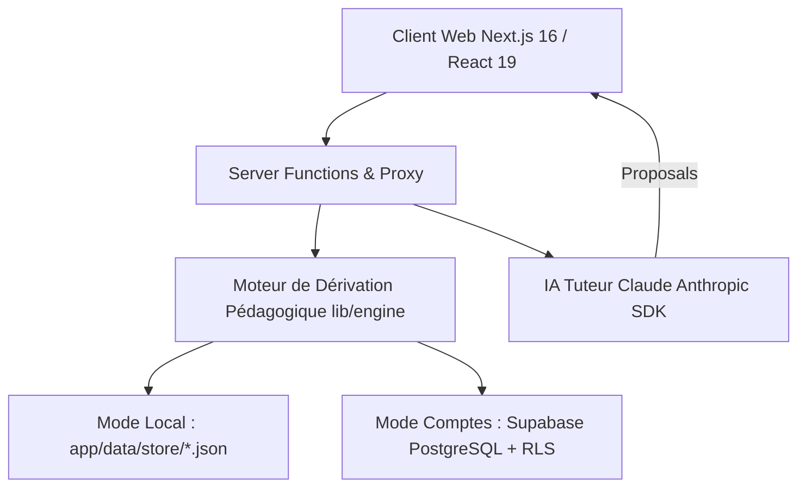

# 🎓 Système Pédagogique MAX — Centre de Pilotage Longitudinal

[](https://nextjs.org/)
[](https://react.dev/)
[](https://www.typescriptlang.org/)
[](https://supabase.com/)
[](https://tailwindcss.com/)
[](https://vitest.dev/)
[](https://www.anthropic.com/)

**Système Pédagogique MAX** est une plateforme web moderne de suivi et de pilotage longitudinal du développement de compétences en **ingénierie des systèmes complexes**.

Contrairement aux LMS et plateformes d'apprentissage traditionnelles, MAX repose sur un **moteur de dérivation pur et factuel** régi par un protocole anti-hallucination strict. Aucun niveau ni score n'est pré-enregistré ou auto-déclaré : tout indicateur (maîtrise, autonomie, XP, badges, recommandations) est **recalculé en temps réel à partir d'un journal de preuves tangibles**.

---

## 🌟 Points Forts & Principes Fondateurs

### 1. 🛡️ Protocole Anti-Hallucination Stricte
- **Rien n'est stocké de ce qui peut être dérivé** : Le stockage (fichiers JSON locaux ou Supabase PostgreSQL) ne conserve que des faits observés (preuves, tentatives d'exercices, séances).
- **Transparence totale ("Pourquoi ?")** : Chaque valeur affichée s'accompagne d'une explication traçable vers ses preuves sources et les réserves éventuelles.
- **Absence de mesure ≠ Zéro** : En l'absence de preuve, le système affiche `—` et non `0/100`.
- **Rétention des contre-preuves** : Un échec ou un retour négatif ne supprime pas le niveau acquis mais dégrade la confiance et la robustesse.

### 2. 🤖 Tuteur Pédagogique IA (Claude / Anthropic)
- Intégration de l'IA Claude d'Anthropic pour analyser les séances et proposer des preuves.
- **Zéro écriture directe en BD** : Le tuteur émet uniquement des *propositions structurées* (compétence, niveau avant/après, autonomie, réserves) que l'utilisateur valide explicitement.
- En l'absence de clé API, l'interface bascule en mode *« Copier le contexte »* pour une utilisation manuelle zéro fuite.

### 3. 🔄 Double Mode de Persistance
- **Mode Local (dev/solo)** : Journal JSON versionné dans `app/data/store/*.json`. Aucune base de données externe requise.
- **Mode Supabase (multi-comptes / production)** : PostgreSQL sécurisé avec RLS (Row Level Security), support d'authentification Email + Mot de passe et Google SSO.

### 4. 🎮 Gamification Non-Farmable
- Les points d'expérience (XP) et niveaux globaux (d' *Observateur* à *Ingénieur Système*) sont déduits à 100 % d'événements de preuve uniques.
- L'autonomie n'est jamais déclarée par l'utilisateur : elle est déduite algorithmiquement du nombre d'indices consultés pendant les exercices.

---

## 🏗️ Architecture du Projet



### Structure des Répertoires

```text
systeme-pedagogique/
├── app/                        # Application Next.js (App Router)
│   ├── data/                   # Données & Protocoles pédagogiques
│   │   ├── 00_instructions/    # Protocoles anti-hallucination & d'évaluation
│   │   ├── 01_profil/          # Référentiel des 43 compétences & matrice
│   │   └── store/              # Journal d'événements local (JSON)
│   ├── src/
│   │   ├── app/                # Routes Next.js (competences, exercices, journal, tuteur, etc.)
│   │   ├── components/         # Composants UI, charts SVG faits maison, layout
│   │   └── lib/
│   │       ├── domain/         # Entités métiers (43 compétences, preuves, séances...)
│   │       ├── engine/         # Moteur pur de dérivation pédagogique (testé Vitest)
│   │       ├── store/          # Abstraction de persistance (Local vs Supabase)
│   │       └── tutor/          # Gestion du contexte et des prompts pour l'IA Claude
│   └── supabase/               # Migrations et schémas SQL Supabase (RLS)
├── AUDIT_SYSTEME_2026-07-25.md # Rapport d'audit d'architecture et de sécurité
├── SETUP_COMPTES_SUPABASE.md   # Guide complet de configuration Supabase & Google SSO
└── SPEC_*.md                   # Spécifications fonctionnelles et chantiers
```

---

## 📐 Règles du Moteur Pédagogique

Le moteur (`app/src/lib/engine/`) transcrit fidèlement les règles définies dans `app/data/00_instructions/` :

| Règle | Exigence / Calcul | Source |
|---|---|---|
| **Niveau 3 (Autonomie)** | Exige 2 preuves autonomes concordantes | Instructions §11 |
| **Niveau 4 (Maîtrise)** | Exige 2 contextes d'application distincts | Évaluation §4 |
| **Niveau 5 (Expertise)** | Exige 1 preuve intégrée combinant ≥ 2 compétences | Évaluation §4 |
| **Échec isolé** | Diminue la confiance sans faire baisser le niveau acquis | Évaluation §9 |
| **Ancienneté** | Dégrade la confiance et la robustesse au fil du temps | Évaluation §7 |
| **Score global** | `30% C + 25% App + 20% T + 15% I + 10% J` (sur 5) | Évaluation §12 |
| **Robustesse** | `Preuves × Diversité × Autonomie × Récence × Délai × Transfert` | Évaluation §13 |

---

## 🚀 Démarrage Rapide

### Prérequis
- **Node.js** v18.17+ ou v20+
- **npm** v9+

### Installation & Lancement

1. **Cloner le dépôt :**
   ```bash
   git clone https://github.com/maxp45160-pixel/systeme-pedagogique.git
   cd systeme-pedagogique
   ```

2. **Installer les dépendances :**
   ```bash
   npm install
   ```

3. **Lancer le serveur de développement :**
   ```bash
   npm run dev
   ```
   L'application est disponible sur **http://localhost:3000**.

---

## 🛠️ Commandes Disponibles

À la racine du projet (ou dans le dossier `app/`) :

| Commande | Action |
|---|---|
| `npm run dev` | Lance l'application en mode développement |
| `npm run build` | Compile l'application pour la production |
| `npm run start` | Démarre le serveur de production |
| `npm run test` | Exécute les tests unitaires du moteur avec Vitest |
| `npm run verify` | Exécute TypeScript (`tsc`), ESLint et les tests Vitest |
| `npm run lint` | Lance la vérification ESLint |

---

## ⚙️ Configuration & Variables d'Environnement

Créez un fichier `app/.env.local` pour configurer les fonctionnalités avancées :

```env
# IA Tutor Anthropic (Optionnel)
ANTHROPIC_API_KEY=sk-ant-api03-...

# Supabase - Mode Comptes & Multi-utilisateurs (Optionnel)
NEXT_PUBLIC_SUPABASE_URL=https://<your-project>.supabase.co
NEXT_PUBLIC_SUPABASE_ANON_KEY=eyJhbGciOiJIUzI1NiIsInR5cCI6IkpXVCJ9...
```

> 📖 Pour la configuration pas à pas de Supabase, de Google SSO et du serveur MCP, consultez le guide [SETUP_COMPTES_SUPABASE.md](SETUP_COMPTES_SUPABASE.md).

---

## 📚 Documentation Associée

- 📑 **[Guide d'Installation Supabase & SSO](SETUP_COMPTES_SUPABASE.md)** : Guide de déploiement et configuration PostgreSQL / RLS.
- 📋 **[Audit du Système](AUDIT_SYSTEME_2026-07-25.md)** : État des lieux architectural et sécurité.
- 📐 **[Spécification Boucle de Preuves](SPEC_CHANTIER1_BOUCLE_PREUVES_2026-07-25.md)** : Spécification technique du moteur de suivi.
- 📂 **[README Application Next.js](app/README.md)** : Détails spécifiques à l'application web.

---

## 📄 Licence

Projet privé — Tous droits réservés.
