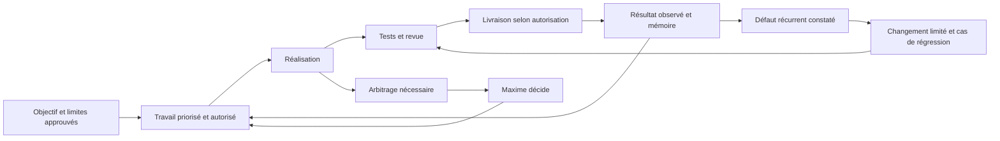

# Audit de l'autonomie du système d'agents Twiny

Date : 15/09/2026. Mission USE-0006, demandée par Maxime.
Nature : faits vérifiés, inférences et recommandations. Aucun arbitrage nouveau
n'est accepté par ce rapport ; aucun contrat actif n'est modifié.

## Conclusion

Le système est utile comme équipe de réalisation et de critique sur mission.
Sa fondation est cohérente : profils natifs, responsabilités, mémoire sourcée,
autorité humaine et vérifications. Son gain de vitesse ou de coût n'est pas
démontré. La construction continue et l'auto-amélioration évaluée restent à
organiser. Augmenter le nombre d'agents n'est pas la prochaine priorité.

La cible raisonnable proposée est : Maxime fixe le résultat et les limites ;
les agents découpent, réalisent, vérifient et reprennent le travail autorisé ;
Maxime intervient lorsqu'une décision sort de ces limites ou exige son jugement.
La capacité à coder ne permet pas à elle seule de choisir la valeur du produit.

## Périmètre et preuves

- Contrats, profils natifs, workflows, mémoire, décisions internes, registre des
  missions et interface des scripts examinés. CTO et QA ont mené deux examens
  natifs indépendants, en lecture seule, avec héritage modèle/effort.
- Git relevé sur `master`, HEAD `60c8617`, avec un chantier applicatif concurrent.
  Le rapport n'audite pas ce diff et ne suppose pas son déploiement.
- Contrôles exécutés par CTO, Node v24.13.0 : contrôleur documentaire, sortie 0,
  40 documents et 243 liens locaux au relevé avant ajout de ce rapport ; six
  tests du contrôleur réussis ; collecteur Git, sortie 0.
- Aucune CI suivie ni configuration locale `core.hooksPath` trouvée lors de
  l'inspection. Les protections du dépôt distant et une éventuelle CI externe
  n'ont pas été vérifiées. Aucun test applicatif, appel fournisseur ou contrôle
  Supabase effectué pour cet audit.
- Les résultats historiques du [registre](../metrics.md), dont l'analyse réelle
  du livret, sont des preuves consignées, pas des essais réexécutés ici.

## Ce qui est bien conçu

1. **Les agents exécutent réellement.** Les cinq profils sont exposés dans
   l'environnement ; CTO et QA ont travaillé pendant cet audit. Les missions
   antérieures distinguent leurs contributions de celles du coordinateur.
2. **L'autorité est explicite.** Une analyse n'est pas une décision, un test vert
   n'est pas une validation produit, un accord donné ne doit pas être redemandé.
3. **Le découpage reste proportionné.** Les contrats évitent une ronde des cinq
   rôles pour une correction simple et exigent des périmètres d'écriture.
4. **La vérification existe.** Les workflows de bug et de réalisation demandent
   diagnostic, tests adaptés, revue et documentation cohérente.
5. **Les inconnues de mesure sont conservées.** DEC-0002 refuse de transformer
   une limite de compte ou un coût inconnu en économie attribuée aux agents.

Sources : [contrat commun](../../agents/common.md), [exécution native](../native-agents.md),
[réalisation](../../workflows/approved-feature.md), [bug](../../workflows/bug.md),
[DEC-0002](../../decisions/DEC-0002-essai-manuel-compute.md).

## Constats prioritaires

### 1. L'autonomie est bornée à une mission, sans enchaînement durable

**Fait.** Le contrat commun, lignes 51–64, et le guide natif, lignes 75–85,
limitent l'autonomie à une mission active. Le backlog contient des propositions
et conditions, pas une file ordonnée de travaux autorisés avec état d'exécution.
Le fonctionnement initial respecte donc le mandat reçu ; il est insuffisant
pour la nouvelle ambition de continuité.

**Conséquence probable.** Maxime reste responsable du passage d'une mission à
la suivante, et parfois de la relance. Un agent ne peut pas inventer l'autorité
qui lui manque en lisant une recommandation du backlog.

**Proposition.** Un mandat durable mais borné, une file de travaux autorisés,
un coordinateur responsable de leur enchaînement et une condition d'arrêt.
Un réveil natif pourra servir de déclencheur si demandé ; il ne remplace ni le
mandat ni l'état de reprise. Aucun nouveau framework n'est justifié à ce stade.

### 2. La mémoire d'état n'est déjà plus synchronisée

**Fait observé.** [current-state](../../company/current-state.md), lignes 4–18,
cite encore `e0c591a` et Qwen. Le HEAD relevé est `60c8617` ; les fiches USE-0002
et USE-0003 décrivent les évolutions ultérieures et l'analyse Mistral réussie.
Le tableau de synthèse de metrics décrit encore USE-0003 comme bloquée, alors
que sa fiche détaillée contient sa réussite. Le backlog conserve PROD-01
« suite à prioriser » malgré cette réalisation partielle désormais documentée.
Cela ne prouve pas que tout le parcours produit est validé.

**Cause organisationnelle probable.** L'entretien est demandé dans plusieurs
workflows, mais l'état courant est recopié à plusieurs endroits et sa mise à
jour n'est pas une preuve obligatoire de clôture. Les liens peuvent rester
valides pendant que leur résumé devient faux.

**Proposition.** Un seul état opérationnel par mission, avec liens vers les
preuves ; une vue courante courte qui l'indexe. À chaque clôture, préciser quels
index sont touchés. Archiver les relevés historiques plutôt que les présenter
comme l'état actuel. Éviter de recopier les résultats dans plusieurs tableaux.

### 3. La validation humaine est bien protégée, mais pas assez opérationnelle

**Fait.** Les catégories d'escalade existent : vision, contradiction avec une
décision humaine, architectures fondamentalement différentes, destruction,
coût significatif et nouveau cloud. Le périmètre des permissions est hérité ;
les rôles ne constituent pas à eux seuls une barrière technique.

**Manque.** Il n'existe pas de contrat unique précisant, pour une mission,
les actions déléguées, le budget, les changements qui invalident un accord,
les conditions de livraison et la manière de conserver un accord à la reprise.
« Important » ou « significatif » ne tranche pas tous les cas pratiques.

**Proposition.** Formaliser le mandat présenté ci-dessous et distinguer décision
humaine, preuve technique et autorisation de publication. Utiliser les contrôles
du runtime et du dépôt pour les limites critiques, en complément des consignes.
Le contrôleur documentaire vérifie la présence d'une provenance ; il ne peut
pas certifier que Maxime a effectivement donné l'accord déclaré.

### 4. L'auto-amélioration n'a pas encore de boucle d'évaluation

**Fait.** Le registre prévoit une revue d'utilité et des propositions de
réduction/fusion des rôles. DEC-0002 autorise un essai manuel borné. Aucun
protocole de référence/candidat, cas de régression, adoption et retour arrière
des instructions n'apparaît dans les sources inspectées.

**Risque, pas incident observé.** Des réécritures de prompts pourraient paraître
meilleures au même agent qui les propose, sans améliorer le travail réel.

**Proposition.** Transformer un échec observé en cas d'évaluation, essayer un
changement limité, le faire vérifier indépendamment et conserver ou annuler
selon les résultats. L'agent ne doit pas pouvoir rendre son résultat acceptable
en abaissant les critères, les permissions ou la définition de « terminé ».
L'auto-amélioration visée concerne les outils, procédures et instructions ;
aucun entraînement autonome du modèle n'est établi ici.

### 5. La reprise et la concurrence reposent trop sur la discipline

**Fait.** Les contrats exigent Git, des périmètres distincts et le transfert des
faits utiles. Ils ne définissent pas un point de reprise obligatoire portant
mission, propriétaire, base Git, fichiers, validations, opérations déjà faites
et prochaine étape. Plusieurs tâches utilisent actuellement le même dépôt ;
aucune perte de modification n'a été constatée par cet audit.

**Proposition.** Un état de reprise court par mission et un responsable unique
de l'intégration. Isoler les réalisations concurrentes par branche/worktree
lorsque c'est utile ; à défaut, attribuer les fichiers et sérialiser les écrits
partagés. Avant de reprendre une action externe, vérifier si elle a déjà réussi.
Après des échecs répétés sans élément nouveau, remonter le blocage avec les
essais utiles, le budget restant et la prochaine option.

### 6. Les contrôles valident surtout la documentation

**Fait.** Les six tests portent sur le contrôleur Markdown. Le guide décrit
explicitement ses limites. La commande applicative `verify` existe, mais les
scripts AI Company ne sont pas branchés aux contrôles npm/CI inspectés.

**Proposition.** Réutiliser les tests existants et ajouter des scénarios de
comportement des agents : accord déjà donné, changement hors mandat, mémoire
périmée, échec d'outil, tâche reprise, tentative de modification des critères.
Une revue QA fournit des contre-exemples ; elle n'est pas, seule, une preuve de
qualité. La réussite technique, la livraison et la validation de valeur produit
doivent rester trois états distincts.

### 7. Une règle d'économie de contexte bloque la vérification

**Fait.** Le contrat commun, lignes 23–25, réserve la lecture des corps de
fonction au besoin de modification. Les contrats QA et bug exigent pourtant
de comprendre et diagnostiquer avant d'éditer. Appliquées littéralement, ces
instructions empêchent certaines revues sémantiques en lecture seule.

**Proposition de formulation.** « Lire d'abord le skeleton, puis uniquement les
corps nécessaires à la compréhension, à la vérification ou à la modification. »
Préserver la lecture ciblée des décisions : le registre ADR dépasse 12 000
lignes au relevé. Sa lecture intégrale systématique serait inutilement coûteuse.

## Mandat d'autonomie proposé

À faire adopter explicitement avant activation ; ce tableau n'accorde aucun
nouveau droit. Une autorisation antérieure applicable conserve sa valeur.

| Situation | Comportement proposé |
|---|---|
| Bug reproductible dans un comportement déjà approuvé | Diagnostiquer, corriger, vérifier et documenter sans nouvel arbitrage. |
| Choix local réversible à l'intérieur du périmètre | Choisir et en rendre compte avec la preuve utile. |
| Incertitude technique accessible | Enquêter/tester d'abord ; demander seulement l'information réellement inaccessible. |
| Modification de la promesse produit ou d'un invariant | Préparer options, recommandation et effets ; demander l'arbitrage avant l'action dépendante. |
| Nouvelle dépense, dépassement de budget, données vers un nouveau destinataire, opération destructive | Vérifier l'autorisation précise ; si absente, présenter l'action concrète à approuver. |
| Merge ou déploiement | Appliquer une politique préalablement autorisée et ses contrôles ; sinon livrer un résultat prêt à examiner. |
| Échec sans progrès, quota ou accès manquant | Conserver le travail, arrêter les essais non informatifs et remonter le blocage. |
| Modification de ses propres droits, critères de réussite ou règles produit | Proposition soumise à Maxime ; aucune adoption autonome. |

Une demande d'arbitrage contient : décision exacte, faits qui la nécessitent,
recommandation, alternative, coût/risque et travaux pouvant continuer.

L'état de mission proposé tient dans une fiche : objectif et critères ; source
de l'accord ; périmètre et exclusions ; budgets autorisés ; propriétaire et
base de travail ; décisions déjà acquises ; actions externes accomplies ;
validations avec version ; état/bloquant ; prochaine action.

## Boucle d'amélioration proposée

Commencer avec les cas déjà rencontrés et des critères stables. Mesurer temps
humain actif, reprises dues à une omission, défauts après livraison, questions
redondantes et usage attribuable lorsqu'il est disponible. Le nombre d'agents,
de lignes écrites ou de tests lancés n'est pas une mesure de valeur.

Conserver un coordinateur, un réalisateur et une revue indépendante quand le
risque le justifie ; Product intervient sur le besoin et Research sur les
incertitudes scientifiques. Les cinq profils actuels suffisent. Prévoir une
limite explicite au travail consacré à améliorer l'organisation pour que Twiny
reste le bénéficiaire principal. Aucune valeur budgétaire n'est fixée ici.

## Ordre de mise en place recommandé

1. Corriger les états périmés ; clarifier la lecture ciblée ; proposer un mandat
   et une fiche de reprise uniques. Preuve : une nouvelle session retrouve le
   travail, l'accord et la prochaine action sans demander une décision déjà prise.
2. Éprouver une réalisation bornée avec les contrôles existants, une intégration
   identifiée et une clôture documentée. Preuve : résultat fonctionnel vérifié,
   limites connues, temps humain observé, aucun statut produit promu.
3. Introduire l'évaluation des changements d'instructions sur des échecs réels,
   avec retour arrière. Preuve : amélioration observée sans régression des cas
   conservés ; les critères d'évaluation ne changent pas pour faire passer le candidat.
4. Ajouter un déclenchement récurrent seulement si la continuité hors session
   est demandée, avec autorisation, budget, disponibilité des outils et arrêt.

## Revue de l'essai compute DEC-0002

La présente mission est la cinquième éligible : USE-0002 à USE-0006. USE-0005 est
encore indiquée en cours au relevé ; cette revue conserve donc une couverture
incomplète et ne déclare pas cinq missions achevées.

| Mission | Résultat consigné ou vérifié | Limite |
|---|---|---|
| USE-0002 | Bilan confrontant Git, pilote et historique. | Gain de temps et coût non mesurés. |
| USE-0003 | Après plusieurs reprises, analyse Mistral de 13 pages réussie ; tests locaux consignés. | Résultat historique non relancé ; coût documentaire distinct du coût des agents ; parcours complet hors preuve. |
| USE-0004 | Avis Product/CTO/QA et arbitrage produit préparé. | Utilité comparative non mesurée. |
| USE-0005 | Réalisation autorisée et en cours au relevé. | Aucune clôture ni verdict final attribué par cet audit. |
| USE-0006 | Audit CTO/QA et synthèse ; contrôles documentaires passent. | Aucune mesure comparative de modèle. |

Tous les choix consignés conservent l'héritage ; aucun contraste de modèle ou
d'effort n'est exploitable. Les reprises les plus longues de USE-0003 concernent
le fournisseur, la configuration et le contrat de sortie ; elles ne démontrent
pas qu'un routeur de modèles aurait aidé. Les coûts attribuables de coordination
et de sous-agents restent inconnus.

**Recommandation issue de cette revue :** garder l'héritage par défaut, ne pas
construire le Compute Router sur ces preuves, simplifier la consignation et
mesurer d'abord le temps humain et les reprises. L'essai n'est pas prolongé
automatiquement ; son autorisation n'est pas transformée en droit permanent.

## Appui externe et limites de généralisation

Les retours d'Anthropic sur les [agents de longue durée](https://www.anthropic.com/engineering/effective-harnesses-for-long-running-agents)
décrivent l'intérêt d'avancées incrémentales, d'un état de reprise explicite et
de vérifications de bout en bout. J'en déduis que renforcer la reprise de Twiny
est plus directement utile qu'ajouter des intitulés de rôles.

Leur [travail sur la séparation réalisation/évaluation](https://www.anthropic.com/engineering/harness-design-long-running-apps)
relève les limites de l'auto-évaluation et précise qu'un évaluateur distinct
peut encore être indulgent. Cela soutient une QA indépendante assortie de
preuves, sans présenter un accord entre agents comme garantie.

Leur [guide des évaluations](https://www.anthropic.com/engineering/demystifying-evals-for-ai-agents)
recommande de partir des échecs réels, de critères explicites et de plusieurs
formes de vérification. Ces retours industriels éclairent la proposition ;
ils ne démontrent aucun gain chiffré pour Twiny.
