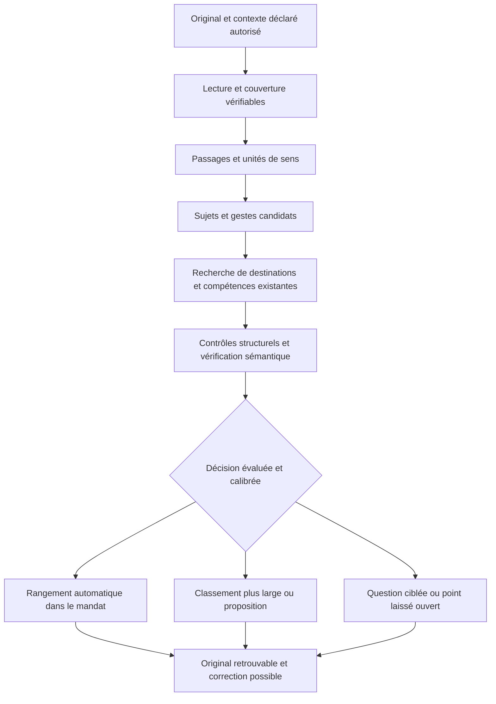

# Vers une classification documentaire fiable — analyse du 24 septembre 2026

Analyse demandée par Maxime : étudier à fond le tri, le rangement et la classification des ressources de Twiny, et déterminer comment viser une erreur quasi nulle. **Les recommandations initiales restent des propositions ; la précision humaine reçue ensuite est consignée séparément ci-dessous.**

**Précision humaine reçue après cette analyse, le 24/09.** Maxime retient la cible de 5 % d'erreurs, une organisation proposée qui s'affine avec le temps et le dialogue, et un avertissement ou au minimum une réorganisation manuelle fluide. L'extraction doit identifier les compétences principales **mentionnées** dans les ressources ; le travail de la journée et ses supports joints doivent pouvoir être classés et conservés. [Source et portée du cadrage](<C:/Users/Maxime/Desktop/Système pédagogique/ai-company/product/cadrage-direction.md#précision-humaine--rangement-progressif-et-travail-de-la-journée-24092026>). Les propositions initiales ci-dessous se relisent avec cette précision : 0,1 % n'est plus la cible demandée, et une mention peut justifier l'identification d'une compétence sans prouver son enseignement, son exercice ou sa maîtrise. Le contrôle doit vérifier la relation affirmée. Le rejet systématique des mentions par P01-0014 constitue donc un écart à cette cible, à faire évoluer. Aucune implémentation n'est effectuée par cette mise à jour documentaire.

Périmètre : checkout local à partir de `11ab9ea8176303241c7ff25406f6d5faa4bcf364`, avec les corrections documentaires non commitées déjà présentes. Lecture ciblée du code, de PRODUCT, des ADR concernés, du modèle cible et des campagnes conservées ; enquêtes indépendantes CTO, QA et Research. Aucun nouvel appel fournisseur, aucune consultation Supabase ni recette en production. Les campagnes antérieures sont relues, pas réexécutées. Aucun code produit modifié.

**Position proposée.** Une erreur très faible sur les décisions automatisées est un objectif à éprouver. Une classification exhaustive, très fine, toujours automatique et presque infaillible sur tout document n'est pas démontrable avec les preuves actuelles. La voie crédible combine fidélité de lecture, décisions séparées, vérification des sources, abstention ciblée et calibration sur une référence humaine. Il faut mesurer simultanément la qualité, la couverture et le travail laissé à la personne.

**Ce que le système sait déjà protéger**

Les originaux, transcriptions, pages traitées, citations et propositions sont distingués. Les identifiants des sources sont sélectionnés par le fournisseur ; le serveur retrouve leur texte exact. Les écritures contrôlent les identifiants actifs, les archives, les choix précédents et les reprises. La délégation se limite à la première analyse d'une nouvelle ressource ; elle ne crée ni ne lie automatiquement des compétences. Les corrections et refus humains sont préservés.

Ces protections sont une base à conserver. Elles établissent principalement l'intégrité et la traçabilité. Elles ne démontrent pas que l'interprétation d'un passage ou le domaine choisi est juste.

Sources : [passages et traduction des références](<C:/Users/Maxime/Desktop/Système pédagogique/app/src/lib/documents/sources-restitution.ts:29>), [délégation](<C:/Users/Maxime/Desktop/Système pédagogique/app/src/lib/documents/delegation-classement.ts:13>), [contrat produit courant](<C:/Users/Maxime/Desktop/Système pédagogique/PRODUCT.md:24>).

**Les limites effectivement observées**

| Constat | Conséquence |
|---|---|
| Dernière campagne : cinq sorties comparables, 48 compétences proposées, 88 citations présentes et au moins cinq gestes non étayés selon la revue d'agent. | La provenance textuelle ne prouve pas que le passage enseigne ou demande le geste. Le ratio indicatif de 10,4 % n'est ni une mesure humaine ni un bilan exhaustif. |
| Deux associations de compétences à `logistique` sont signalées comme incompatibles avec leur matière. | Le domaine doit être évalué séparément de l'intitulé de compétence. Le ratio précédent ne mesure pas ces erreurs. |
| Une abstention totale supprime dans C10 une synthèse inventée, mais aussi la recopie attendue selon la revue. | Une meilleure précision apparente peut cacher une perte de couverture. Zéro proposition donne une précision indéfinie, pas 100 %. |
| C04 ne traite que 20 pages sur 82 ; C05 échoue avant le fournisseur après augmentation de la taille du contrat. | Il faut compter lecture partielle et échec technique dans la réussite du parcours, sans les transformer en erreurs sémantiques corrigées. |
| Aucun référentiel humain exhaustif des compétences attendues. | Le taux d'omission et les seuils produit de moins de 5 % ne sont pas démontrés. |

Ces constats viennent de la [mesure du 24 septembre](<C:/Users/Maxime/Desktop/Système pédagogique/docs/pilotes/MESURE_FIDELITE_2026-09-24.md:28>). Le corpus déjà utilisé pour les corrections est utile pour la régression, pas comme test final indépendant.

Le code explique plusieurs fragilités :

- **L'incertitude est essentiellement déclarative.** La délégation rejette les pages marquées incertaines et les éléments d'incertitude produits par l'analyse. En leur absence, des sources non vides et les gardes structurelles permettent l'éligibilité. Aucun risque sémantique calibré n'est calculé. Une erreur non signalée peut donc passer. À l'inverse, une incertitude locale peut bloquer tout le rattachement. [Garde actuelle](<C:/Users/Maxime/Desktop/Système pédagogique/app/src/lib/documents/delegation-classement.ts:54>).
- **Le filtre d'ancrage dépend du même modèle.** Une déclaration `consigne` ou `demonstration` correctement structurée peut laisser passer une invention. Le test existant le reconnaît expressément. [Contre-exemple](<C:/Users/Maxime/Desktop/Système pédagogique/app/src/lib/documents/ancrage-competences.test.ts:109>).
- **Les déclarations personnelles conservées ne sont pas chargées comme contexte structuré dans l'analyse initiale.** Celle-ci reçoit la note, les pages et le référentiel actif ; la note peut déjà contenir du contexte fourni explicitement. Les déclarations conservées sont chargées dans le dialogue ultérieur. Le chemin du dossier n'est pas un contexte structuré de classification. [Analyse](<C:/Users/Maxime/Desktop/Système pédagogique/app/src/lib/store/depot-analyse.ts:151>), [dialogue](<C:/Users/Maxime/Desktop/Système pédagogique/app/src/lib/store/dialogue-ressource.ts:32>). Cela ne justifie pas de déduire une intention ; seules les déclarations pertinentes et autorisées pourraient être réutilisées.
- **La structure documentaire est peu exploitée.** Les passages sont des lignes, découpées si nécessaire ; le payload transmet leur texte et l'incertitude, sans description structurée du rôle « sommaire / définition / méthode / exercice / corrigé ». Les titres de sections EPUB restent dans les références, sans champ structuré de section transmis avec chaque groupe de passages. Cette organisation facilite la citation exacte mais laisse au modèle la reconnaissance de ces rôles.
- **Un appel traite de nombreux problèmes simultanément.** Sujet, nature, domaine, parent et compétences sont produits ensemble, avec au plus 30 compétences et 8 192 jetons de réponse. Le référentiel actif entier est envoyé. Ces bornes limitent les longs documents et risquent de coûter davantage à mesure que le compte grandit. [Types et bornes](<C:/Users/Maxime/Desktop/Système pédagogique/app/src/lib/documents/depot.ts:17>).
- **Retrouver reste fragile.** La recherche de l'Atelier filtre titre, identifiant, type et tags ; elle n'interroge pas les passages. Le domaine explicite prime correctement sur le repli historique par compétence. Un classement imparfait est donc moins facilement compensé par une recherche dans le contenu. [Recherche](<C:/Users/Maxime/Desktop/Système pédagogique/app/src/components/atelier/espace-documentaire.tsx:741>).

Il existe aussi un classement lexical des domaines du compte dans une carte des savoirs. C'est une suggestion dérivée, distincte du classement des documents : son appel apparaît dans `vue-atelier.ts:701`. Ses scores de similarité ne sont pas des probabilités de classement correct.

**Définir les décisions avant de chercher un meilleur modèle**

| Décision | Question précise | Exemple |
|---|---|---|
| Nature du support | Quel type de document est présent ? | Cours, exercice, référence, pensée personnelle. |
| Sujet | De quoi parlent les passages ? | Probabilités conditionnelles. |
| Rangement principal | Où retrouver ce support dans le compte ? | Mathématiques → Probabilités. |
| Usage personnel | Pourquoi cette personne le conserve-t-elle ? | Préparer un examen de logistique, si elle le déclare. |
| Relation pédagogique | Quel geste est demandé, enseigné, seulement mentionné ou prérequis ? | Calculer une probabilité conditionnelle. |
| Identité | Le domaine ou savoir-faire existe-t-il déjà ? | Même capacité sous une autre formulation, ou capacité voisine différente. |

Un document de probabilités appliquées à la logistique peut avoir un sujet mathématique et servir un module de logistique. Ces deux relations sont compatibles. Les confondre conduit à ranger selon un contexte d'application, ou à créer une compétence pour chaque anecdote d'exercice.

Le contrat actuel conserve **un domaine principal facultatif par ressource**, des domaines hiérarchiques et plusieurs liens explicites de compétences. Il permet de commencer sans refaire le modèle. Des facettes et relations notionnelles supplémentaires seraient une évolution à arbitrer, pas des tables à créer automatiquement. La nature proposée doit aussi être distinguée de celle réellement enregistrée : la confirmation actuelle conserve le titre/type du dépôt ; une suggestion de type ne prouve pas son application.

La taxonomie personnelle doit préciser, pour les catégories réellement utilisées, définition, inclusions, exclusions, exemples et synonymes acceptés. Un nom seul comme « Modèles » est insuffisant. Les corrections de la personne doivent rester prioritaires, mais une correction ponctuelle ne devient pas automatiquement une règle générale. Les nouveaux sujets restent recevables même s'ils sont absents du référentiel.

**Chaîne recommandée, à construire progressivement**

**1. Stabiliser ce qui est lu.** Préserver la mise en relation entre original, transcription et localisation ; contrôler formules, tableaux, légendes et ordre de lecture. Une citation exacte de transcription erronée reste une preuve faible. Adapter l'extraction au format et à sa qualité ; comparer une extraction textuelle et une lecture visuelle seulement quand le bénéfice attendu et le consentement le justifient. Réutiliser les transcriptions compatibles pour éviter de repayer l'OCR.

Une unité de traitement devrait conserver une consigne et ses sous-questions, ou une méthode avec ses conditions, plutôt que couper uniquement à une longueur arbitraire. Les repères exacts actuels restent utiles pour retrouver les citations. Aucune partie non lue ne devient implicitement couverte ; le sommaire peut orienter une lecture, mais ne prouve pas l'enseignement des compétences qu'il annonce.

**2. Produire des candidats locaux, puis agréger.** Extraire les sujets et gestes par unité pertinente, en conservant la différence entre mention, enseignement et demande. Réunir ensuite les candidats à l'échelle du document. Cela permet de traiter les ouvrages longs sous des budgets bornés, de retrouver des sous-questions et de ne pas confondre « 30 propositions sorties » avec « document complet ». Le découpage ne résout pas à lui seul les dépendances entre chapitres : des fenêtres de contexte et une agrégation doivent être évaluées.

Le traitement par morceaux peut être interne à une opération consentie ; il ne doit pas imposer une validation par morceau à la personne. L'actuelle obligation de confirmer avant « Lire la suite » relève d'un contrat existant : la modifier demanderait un arbitrage explicite. La répétition d'appels doit tenir dans le plafond présenté, sans réessai payant caché.

**3. Chercher avant de créer.** Rechercher quelques domaines et compétences plausibles dans le référentiel du compte, avec leurs définitions, chemins, exemples et différences. Conserver une issue « aucun ne convient ». Un essai peut comparer recherche lexicale, recherche sémantique et leur combinaison, puis un reclassement des candidats. La recherche doit maximiser la présence de la bonne option ; la décision finale doit vérifier l'équivalence, pas seulement la proximité.

BEIR montre l'intérêt de comparer des méthodes de recherche hétérogènes et la robustesse de bases lexicales ; il ne démontre pas qu'un moteur vectoriel donné serait supérieur sur Twiny. Une similarité élevée ne prouve jamais l'identité de deux compétences. Commencer avec le référentiel actuel, sans nouveau service, puis mesurer la nécessité d'un index plus riche. [Thakur et al., BEIR, 2021](https://arxiv.org/abs/2104.08663).

**4. Vérifier chaque assertion avec une question étroite.** Le contrôle devrait distinguer : citation exacte ; source lisible ; geste effectivement demandé/enseigné ; objet et conditions conservés ; niveau de généralisation recevable ; rattachement cohérent. Par exemple, le titre « Régression avec brms » autorise à reconnaître un thème, pas à affirmer qu'une méthode brms est enseignée dans les pages reçues.

Un vérificateur sémantique reçoit la proposition, ses passages et leur contexte, puis cherche ce qui la soutient ou la contredit. Il peut être un modèle distinct ou un appel séparé évalué ; son accord n'est pas une preuve indépendante par construction. Mesurer les erreurs du générateur qu'il laisse passer **et** les bonnes propositions qu'il rejette. Ne pas calculer un risque conjoint en multipliant arbitrairement deux taux d'erreur. Les résultats d'ALCE distinguent justement qualité des citations et correction des réponses. [Gao et al., 2023](https://aclanthology.org/2023.emnlp-main.398/).

**5. Calibrer l'automatisation, décision par décision.** Remplacer progressivement « aucune incertitude déclarée » par une règle dont le risque a été mesuré sur des cas humains indépendants. Qualité de lecture, couverture, conflit entre candidats, compatibilité du domaine, vérification du geste et antécédents de correction peuvent fournir des signaux. Aucun de ces signaux, pris isolément, n'est une probabilité garantie.

Autoriser un domaine large suffisamment étayé même si son sous-domaine reste incertain ; ne pas étendre la délégation aux compétences par cette seule analyse. Une formule illisible peut suspendre une compétence sans forcément invalider le sujet général. Les créations de domaines doivent recevoir une évaluation distincte des rattachements à des domaines existants : leur erreur pollue davantage l'organisation future.

La classification hiérarchique sélective étudie ce compromis entre exactitude et spécificité. Ses hypothèses d'arbre à feuilles exclusives ne correspondent pas directement aux relations multiples de Twiny. Retenir le principe du repli, sans importer ses garanties numériques. Compter séparément la précision utile : tout ranger dans une racine universelle ne serait pas une réussite. [Goren, Galil et El-Yaniv, 2024](https://arxiv.org/html/2405.11533v2).

**6. Demander peu, mais demander utilement.** Une question doit lever une ambiguïté que le support ne peut résoudre : rattachement à un module, contexte personnel, distinction entre deux domaines proches. Une réponse telle que « c'est pour mon examen de logistique » précise l'usage ; elle ne change pas automatiquement la matière enseignée. Réutiliser les déclarations déjà conservées, avec leur portée. Ne pas solliciter systématiquement l'utilisateur pour les décisions indépendantes déjà fiables.

**7. Permettre de retrouver même si le rangement reste incomplet.** Ajouter progressivement une recherche des passages, avec titre, contexte et accès à l'original. Le rangement principal reste un point d'entrée ; les liens confirmés et la recherche offrent d'autres accès sans dupliquer l'original. Mesurer des tâches réelles de retrouvabilité, pas uniquement la conformité d'un arbre.

**Ce que la recherche autorise à affirmer**

- L'auto-évaluation d'un modèle peut fournir un signal, mais sa calibration ne se transfère pas automatiquement entre tâches. Un « 99 % » rédigé par le modèle n'est pas une mesure de fiabilité Twiny. [Kadavath et al., 2022](https://arxiv.org/html/2207.05221v4).
- Redemander au même modèle de se corriger n'est pas une assurance qualité. Certaines expériences d'auto-correction sans retour externe détériorent les réponses ; cela ne constitue pas une impossibilité universelle pour les modèles actuels. [Huang et al., ICLR 2024](https://arxiv.org/html/2310.01798v2).
- Conformal Risk Control contrôle une espérance de perte bornée et monotone sous échangeabilité. Son contrôle des omissions en multi-label ne contrôle pas automatiquement les fausses propositions ni le risque conditionnel parmi les décisions automatisées. [Angelopoulos et al., ICLR 2024](https://arxiv.org/abs/2208.02814).
- Learn then Test permet de calibrer des règles et plusieurs risques définis, avec correction des tests multiples, sous les hypothèses d'échantillonnage requises. Il peut ne certifier aucune règle : aucune méthode de calibration ne transforme un modèle médiocre en système exhaustif et infaillible. [Angelopoulos et al., 2021, révision 2022](https://arxiv.org/abs/2110.01052).

L'application de ces méthodes à Twiny reste une recommandation expérimentale. Une taxonomie qui change, une nouvelle matière, un OCR différent ou une nouvelle version de modèle peuvent invalider l'extrapolation ; il faut recontrôler les populations concernées.

**Mesurer la promesse complète**

| Mesure | Dénominateur à conserver |
|---|---|
| Erreurs d'automatisation | Décisions réellement appliquées automatiquement. |
| Propositions incorrectes | Toutes les propositions évaluables, avant puis après filtre. |
| Omissions | Attendus humains dans le périmètre annoncé ; une abstention ne les efface pas. |
| Documents correctement organisés | Documents évalués, avec règle explicite sur les erreurs et points encore ouverts. |
| Couverture technique | Imports et analyses tentés, y compris refus et échecs. |
| Couverture utile | Part traitée automatiquement au niveau de précision attendu, pas seulement rattachée à un ancêtre trivial. |
| Retrouvabilité | Recherches représentatives où le bon document/passage est effectivement retrouvé. |
| Charge et coût | Temps de revue/correction, questions, latence et coût par document utilement organisé. |

Publier ces mesures par format, matière et type de décision. Les compétences d'un même document sont corrélées ; une moyenne par proposition peut masquer des documents entièrement ratés. Par exemple, un document erroné avec une proposition et un document correct avec cent propositions donnent 0,99 % d'erreur par proposition, malgré un document sur deux touché.

L'évaluateur actuel fournit une base utile : il distingue erreurs et omissions de compétences, références synthétiques et humaines déclarées, sorties partielles et précision indéfinie. Mais `SOUS_SEUIL` compare un taux observé à 5 %, sans intervalle de confiance ; l'omission n'est pas exposée pour toutes les autres fonctions. La QA a reproduit ces limites et exécuté **42 tests réussis** sur l'évaluateur et l'ancrage. Cela vérifie les garde-fous logiciels, pas la justesse documentaire. [Évaluateur](<C:/Users/Maxime/Desktop/Système pédagogique/app/src/lib/documents/evaluation-classification.ts:132>).

La référence humaine doit être construite avant de montrer les propositions : originaux, couverture examinée, gestes attendus, plusieurs classements acceptables, granularité et ambiguïtés. Une double annotation avec arbitrage est souhaitable sur un sous-ensemble important et les cas disputés. Le contexte personnel doit venir de la personne. La convention doit aussi préciser si « recopier » est une compétence pertinente pour l'usage concerné : le document ne décide pas seul de la granularité utile.

Séparer développement, calibration et test final **par document, cours et famille de sources**. Les conversions PDF/EPUB et les chapitres du même ouvrage ne doivent pas se retrouver de part et d'autre. Les annotations d'agents peuvent préparer les cas, jamais être renommées références humaines. Répéter plusieurs générations sur un sous-lot mesure la variabilité, sans augmenter artificiellement le nombre de documents indépendants.

Pour donner l'échelle de la preuve : avec zéro erreur observée, une règle figée et des unités binaires indépendantes représentatives d'une population stable, la borne supérieure exacte unilatérale à 95 % vaut `1 − 0,05^(1/n)`.

| Risque que l'on veut borner | Minimum sans erreur dans ce cadre |
|---|---:|
| Moins de 1 % | 299 |
| Moins de 0,1 % | 2 995 |

Ces effectifs concernent une mesure et une population définies, pas toutes les catégories simultanément. Des erreurs observées, des comparaisons multiples et la corrélation changent les besoins. Cinquante compétences issues de cinq documents ne valent pas cinquante cas indépendants. Calcul appliqué à partir de la [méthode binomiale exacte du NIST](https://www.itl.nist.gov/div898/software/dataplot/refman2/auxillar/exacbino.htm).

**Ordre de travail recommandé**

1. **Réparer les blocages de la recette et définir la vérité attendue.** Traiter la requête EPUB trop volumineuse, préciser sujet/rangement/geste/usage et la granularité, conserver les erreurs connues comme régressions. Commencer par un corpus humain diversifié de quelques dizaines de documents pour apprendre où le système échoue ; il ne certifiera pas 0,1 %.
2. **Comparer des variantes sur les mêmes supports.** A : système actuel. B : génération identique avec vérification ciblée et abstention. C : unités de sens, recherche de candidats et repli hiérarchique, avec les mêmes mesures. Comparer aussi un modèle plus capable sur un lot borné si autorisé, pour isoler l'effet modèle de l'effet architecture. Aucune option fournisseur n'est présumée gagnante.
3. **Choisir le compromis sur calibration, puis le vérifier en aveugle.** Fixer une cible d'erreur, une couverture minimale utile et une charge de correction maximale avant le test final. Le seuil existant de moins de 5 % d'erreurs ET d'omissions reste le premier jalon humain ; une cible de 1 % ou 0,1 % serait une ambition supplémentaire à arbitrer.
4. **Déployer progressivement l'automatisation dans son mandat.** D'abord les décisions effectivement démontrées fiables ; laisser les cas nouveaux en proposition. Contrôler un échantillon aléatoire des cas automatiques, y compris ceux jamais corrigés spontanément. Absence de plainte ne vaut pas classement juste. Réévaluer après changement de modèle, lecture ou taxonomie.

Le budget documentaire de 5 €/mois et les consentements existants font partie du problème. Une double lecture et plusieurs appels sur chaque page pourraient rendre la solution inutilisable. Mesurer le coût marginal de chaque étape, réutiliser les extractions, sélectionner le contexte pertinent et réserver les traitements plus chers aux cas qui en bénéficient. Un nouveau fournisseur, un index externe ou une hausse du budget ne sont pas autorisés par cette analyse.

**Défaut fonctionnel annexe reproduit pendant l'audit**

La sélection cumulative autorise jusqu'à 1 000 liens de compétences, mais la validation finale de rangement refuse plus de 30. Sur 31 codes valides, le premier validateur retourne 31 et le second lève « Trop de compétences liées à une ressource ». La confirmation appelle cette garde après des opérations de référentiel : il faut vérifier les effets partiels lors de la correction. Reproduction locale en mémoire, sans écriture ni réseau ; aucun correctif effectué ici. [Sélection](<C:/Users/Maxime/Desktop/Système pédagogique/app/src/lib/documents/classement-ressources.ts:27>), [garde finale](<C:/Users/Maxime/Desktop/Système pédagogique/app/src/lib/documents/validation-rangement.ts:9>), [ordre des opérations](<C:/Users/Maxime/Desktop/Système pédagogique/app/src/lib/store/classement-ressources-actions.ts:224>).

**Suite après la précision humaine du 24/09.** La cible de 5 % et le principe d'une organisation progressive et corrigeable sont fixés. Préparer une tranche qui identifie les compétences principales mentionnées avec leur relation exacte à la source, permet la reprise fluide du rangement et relie le travail daté aux supports confiés. Les critères de recette doivent contrôler les compétences principales attendues, les erreurs de relation, la correction manuelle et la conservation du travail quotidien. Le corpus, les détails d'interface et l'expérience payante restent à préciser ; aucun nouveau budget ni chantier de code n'est engagé par ce cadrage.
