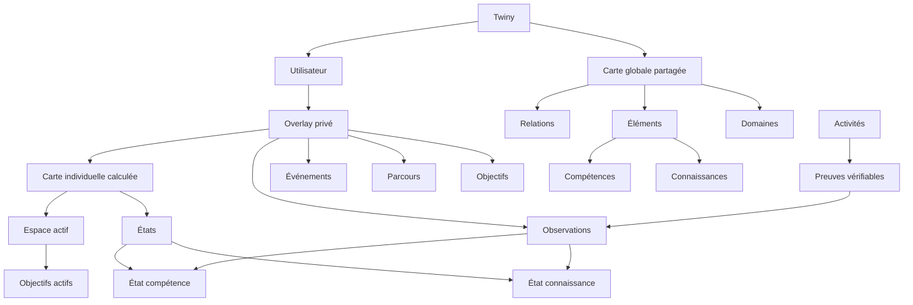

# Twiny - Modèle central

> Architecture métier cible en cours de conception. Ce document est la
> transcription Markdown de `Structure TWINY.pdf`.
>
> Il décrit le vocabulaire et les relations métier cibles. Il ne constitue pas
> un schéma SQL, une organisation de code ou une stratégie de migration.
> Aucun concept ne doit donc devenir automatiquement une table, un service ou
> une entité persistée.

**Contrats validés le 20/08/2026.** Les précisions de ce document appliquent
les décisions humaines explicites consignées par
[ADR-089 à ADR-095](../../ARCHITECTURE_DECISIONS.md#adr-089). Les ADR portent
les justifications ; ce modèle n'en recopie que les conséquences métier.

> ⚠️ **Révision du 21/08/2026 (ADR-096).** La forme persistée des objectifs
> structurés et des parcours (lot 4) a été retirée après retrait humain
> explicite. Les sections 8, 9 et 10 restent la description du vocabulaire
> cible ; côté implémenté, le parcours est une file d'actions **dérivée**
> (recommandations ordonnées), visible uniquement par les actions
> recommandées, et les intentions déclarées restent des textes verbatim du
> profil. Aucun concept des sections 8–10 n'est persisté aujourd'hui.

## Vue de synthèse

## 1. Architecture générale

### Les quatre couches

1. **Carte globale partagée** : les éléments déclarés du catalogue commun et
   leurs relations validées ; elle est générique, sourcée, versionnée,
   extensible et non exhaustive.
2. **Overlay privé** : la relation personnelle d'un compte à la carte —
   sélections, éléments locaux, objectifs, parcours et événements —, jamais
   une copie de la carte globale.
3. **Observation privée** : activités, preuves vérifiables et observations
   sourcées du compte ; rien ne remonte globalement sans validation humaine.
4. **Vues calculées privées** : états, carte individuelle et espace actif,
   dérivés de la carte globale et de l'overlay sans stockage autoritatif.

### Overlay privé

L'overlay est la relation personnelle du compte à la carte. Sa partie persistée
ne contient que des faits déclarés ou observés : sélections, éléments locaux,
objectifs, parcours, événements et observations. Les états qui la complètent à
la lecture sont calculés. Aucun élément local ni aucune donnée personnelle
n'entre dans la carte globale sans validation humaine explicite et provenance
([ADR-089](../../ARCHITECTURE_DECISIONS.md#adr-089) et
[ADR-091](../../ARCHITECTURE_DECISIONS.md#adr-091)).

### Règle d'architecture

Un élément de la carte ne contient pas l'état d'un utilisateur. L'état est une
relation calculée entre un utilisateur et un élément ; il n'est pas un fait
persisté.

Une preuve est une trace durable vérifiable, ou une référence durable vers un
artefact vérifiable. Elle n'est pas directement une mesure : elle produit une
ou plusieurs observations qui alimentent l'estimation de l'état
([ADR-090](../../ARCHITECTURE_DECISIONS.md#adr-090)).

### Flux fondamental

Besoin ou objectif → zone pertinente de la carte → activités → preuves →
observations → recalcul des états → nouvelle carte individuelle →
recommandations.

## 2. Domaine

### Définition

Une région de la carte globale utilisée pour situer et organiser les éléments
d'apprentissage. Elle fournit un contexte et un niveau de zoom.

### Persistance

À déterminer. Le modèle métier ne prescrit pas la traduction technique.

### Rôle dans Twiny

Situer les connaissances et compétences dans un ensemble plus large et
permettre la navigation macro → micro.

### Propriétés minimales

- identifiant stable ;
- nom et description ;
- niveau ou granularité ;
- métadonnées éventuelles.

### Relations principales

- `PART_OF` avec un domaine parent ;
- regroupe des éléments d'apprentissage ;
- `RELATED_TO` avec d'autres domaines.

### Ce que ce n'est pas

Ce n'est pas automatiquement une compétence, un parcours ou un programme.

### Exemple

Mathématiques → Algèbre → Algèbre linéaire.

## 3. Élément d'apprentissage

### Définition

Objet générique représentant une unité de la carte susceptible d'être apprise,
comprise, utilisée ou évaluée.

### Persistance

À déterminer. Le modèle métier ne prescrit pas la traduction technique.

### Rôle dans Twiny

Créer un socle commun pour les connaissances et les compétences.

### Propriétés minimales

- identifiant stable ;
- nom ;
- description ;
- type : connaissance ou compétence ;
- domaines associés ;
- relations.

### Relations principales

- `PART_OF` ;
- `PREREQUISITE_OF` ;
- `RELATED_TO` ;
- `APPLIED_IN` ;
- `ENABLES` ;
- possède des états utilisateur.

### Ce que ce n'est pas

Ce n'est pas nécessairement une unité atomique absolue : sa granularité doit
être utile à la décision pédagogique.

### Exemple

« Dérivée » / « Calculer la dérivée d'une fonction ».

## 4. Connaissance

### Définition

Élément d'apprentissage déclaré dans la carte représentant ce qu'une personne
peut connaître, reconnaître, rappeler, expliquer ou comprendre. Une
Connaissance peut référencer des ressources documentaires qui la définissent,
l'illustrent ou l'étayent.

### Persistance

À déterminer. Le modèle métier ne prescrit pas la traduction technique.

### Rôle dans Twiny

Représenter le contenu conceptuel du parcours, et pas seulement ce que
l'utilisateur sait faire.

### Propriétés minimales

- formulation ou contenu ;
- relations conceptuelles ;
- références documentaires éventuelles et leur provenance ;
- modalités d'évaluation possibles.

### Relations principales

- située dans un domaine ;
- peut être prérequis d'une compétence ;
- peut être liée à d'autres connaissances ;
- possède un état de connaissance.

### Ce que ce n'est pas

Elle n'est ni automatiquement une compétence démontrée, ni un document promu
par sa seule présence dans le corpus. Le corpus existant n'est pas converti
automatiquement
([ADR-092](../../ARCHITECTURE_DECISIONS.md#adr-092)).

### Exemple

« Une dérivée mesure localement la variation d'une fonction. »

## 5. Compétence

### Définition

Type d'élément d'apprentissage représentant une capacité à réaliser, appliquer,
produire, résoudre ou démontrer quelque chose.

### Persistance

À déterminer. Le modèle métier ne prescrit pas la traduction technique.

### Rôle dans Twiny

Représenter le savoir-faire et permettre son estimation à partir de preuves
observables.

### Propriétés minimales

- capacité visée ;
- contexte éventuel ;
- critères d'observation éventuels.

### Relations principales

- peut avoir des connaissances comme prérequis ;
- peut permettre une autre compétence ;
- possède un état de compétence ;
- est alimentée par des observations.

### Ce que ce n'est pas

Elle n'est pas la preuve elle-même.

### Exemple

« Calculer la dérivée d'une fonction polynomiale. »

## 6. Relation

### Définition

Lien typé entre deux objets de la carte ou du modèle. Sa signification doit
être explicite.

### Persistance

Une relation déclarée, validée et sourcée est un fait persistable avec sa
provenance. Les similarités, proximités et inférences restent des vues
calculées. Les types ci-dessous ne prescrivent pas une structure de stockage
dédiée ([ADR-093](../../ARCHITECTURE_DECISIONS.md#adr-093)).

### Rôle dans Twiny

Faire du système un graphe plutôt qu'une simple arborescence.

### Propriétés minimales

- source ;
- cible ;
- type ;
- poids ou force éventuelle ;
- confiance éventuelle ;
- origine ou justification.

### Relations principales

- relie domaines et éléments ;
- est exploitée par le moteur de parcours ;
- est affichable dans les vues de graphe.

### Ce que ce n'est pas

Une relation déclarée ne doit pas être déduite uniquement d'une proximité
visuelle ou sémantique. Une proposition du tuteur n'est pas publiée dans la
carte globale sans validation humaine explicite.

### Exemple

`A PREREQUISITE_OF B` signifie que A constitue un prérequis identifié pour B.

## 7. Utilisateur

### Définition

Entité représentant la personne dont Twiny modélise le parcours et la position
relative dans la carte.

### Persistance

À déterminer dans ce modèle métier. La représentation du compte et de
l'authentification n'est pas définie ici.

### Rôle dans Twiny

Porter l'overlay privé : objectifs, contexte, sélections, éléments locaux,
événements, observations et états calculés.

### Propriétés minimales

- identifiant ;
- profil et contexte ;
- préférences utiles ;
- historique ;
- objectifs.

### Relations principales

- possède un overlay privé, jamais une copie de la carte globale ;
- possède des états ;
- possède des parcours ;
- génère ou reçoit des événements ;
- dispose d'une carte individuelle calculée.

### Ce que ce n'est pas

Il ne possède pas une copie indépendante de la carte globale : il entretient
une relation avec certains de ses éléments.

### Exemple

Deux utilisateurs peuvent partager la même carte globale mais avoir des
positions différentes.

## 8. Objectif

### Définition

Intention explicite, datée et structurée représentant une destination que
l'utilisateur souhaite atteindre. Un compte peut porter plusieurs objectifs.

### Persistance

Fait déclaré persistable. Les objectifs historiques restent verbatim : aucun
texte n'est interprété ni rattaché automatiquement à une cible. Le modèle
métier ne prescrit pas la traduction technique
([ADR-094](../../ARCHITECTURE_DECISIONS.md#adr-094)).

### Rôle dans Twiny

Donner une direction au moteur et sélectionner une zone pertinente de la carte.

### Propriétés minimales

- formulation ;
- cible typée : domaine, élément ou relation ;
- priorité ;
- horizon ;
- statut ;
- dates de création, d'évolution et de clôture éventuelle.

### Relations principales

- appartient à un utilisateur ;
- peut activer un parcours ;
- alimente l'espace actif.

### Ce que ce n'est pas

Un objectif n'est pas forcément une compétence, ni un état dérivé, ni une
intention extraite automatiquement d'un texte historique.

### Exemple

« Comprendre les bases nécessaires pour suivre un cours de machine learning. »

## 9. Parcours

### Définition

Trajectoire contextualisée d'un utilisateur à travers une partie de la carte au
cours du temps.

### Persistance

À déterminer. Le modèle métier ne prescrit pas la traduction technique.

### Rôle dans Twiny

Relier point de départ, intention, activités, événements et évolution.

### Propriétés minimales

- utilisateur ;
- intention ou contexte ;
- date de début ;
- statut ;
- zone concernée.

### Relations principales

- référence des événements ;
- est lié à des objectifs ;
- concerne des éléments ;
- peut alimenter l'espace actif.

### Ce que ce n'est pas

Ce n'est pas une simple liste de compétences : c'est une trajectoire temporelle.

### Exemple

« Apprendre les bases du machine learning pour un projet personnel ».

## 10. Événement

### Définition

Occurrence datée dans l'histoire de l'utilisateur susceptible de modifier ou
documenter son parcours.

### Persistance

À déterminer. Le modèle métier ne prescrit pas la traduction technique.

### Rôle dans Twiny

Constituer la chronologie brute du système.

### Propriétés minimales

- date ;
- type ;
- acteur ou origine ;
- contexte ;
- objets concernés.

### Relations principales

- peut appartenir à un parcours ;
- peut déclencher une activité ;
- peut créer une preuve ;
- peut modifier un objectif ou un état.

### Ce que ce n'est pas

Un événement n'est pas automatiquement une preuve ni une mesure.

### Exemple

Création d'un objectif, lecture d'une ressource, évaluation terminée.

## 11. Activité

### Définition

Action ou tâche réalisée par l'utilisateur dans le cadre de son apprentissage.

### Persistance

À déterminer. Le modèle métier ne prescrit pas la traduction technique.

### Rôle dans Twiny

Créer la matière observable à partir de laquelle peuvent émerger des preuves.

### Propriétés minimales

- type ;
- contexte ;
- date ;
- durée éventuelle ;
- ressources mobilisées ;
- éléments ciblés.

### Relations principales

- est enregistrée comme événement ;
- peut produire plusieurs preuves ;
- peut concerner plusieurs éléments ;
- peut appartenir à un parcours.

### Ce que ce n'est pas

Une activité n'est pas nécessairement une réussite.

### Exemple

Résoudre un exercice, rédiger un texte, réaliser un projet.

## 12. Preuve

### Définition

Trace concrète et vérifiable produite ou collectée à propos d'une activité et
pouvant servir de base à une évaluation. Une référence durable vers un artefact
vérifiable satisfait ce contrat si la trace reste retrouvable.

### Persistance

La trace elle-même ou sa référence doit être durable. Cette exigence métier ne
permet pas d'en déduire automatiquement une table, une forme SQL ou un stockage
distinct ([ADR-090](../../ARCHITECTURE_DECISIONS.md#adr-090)).

### Rôle dans Twiny

Conserver le support vérifiable qui justifie les inférences du système.

### Propriétés minimales

- source ;
- contenu ou référence ;
- date ;
- contexte ;
- activité d'origine.

### Relations principales

- provient d'une activité ou d'un événement ;
- peut produire plusieurs observations ;
- peut concerner plusieurs éléments.

### Ce que ce n'est pas

Une preuve n'est ni directement un score de maîtrise, ni l'actuelle ligne
`evidence` : celle-ci représente une Observation dans le vocabulaire cible.

### Exemple

Réponse, code produit, résultat de projet, présentation.

## 13. Observation

### Définition

Constat structuré, daté et sourcé extrait d'une preuve ou d'une activité et
interprétable par le moteur.

### Persistance

Persistée en append-only avec une source explicite. Une correction ajoute un
nouveau fait ou un événement de rectification ; elle ne réécrit pas le constat
historique. Cette décision ne prescrit pas à elle seule une table
([ADR-090](../../ARCHITECTURE_DECISIONS.md#adr-090)).

### Rôle dans Twiny

Transformer une trace brute en signal exploitable pour estimer un état.

### Propriétés minimales

- élément concerné ;
- résultat ou constat ;
- contexte ;
- niveau de confiance ;
- origine ;
- date.

### Relations principales

- dérive d'une preuve ou activité ;
- alimente le recalcul d'un état ;
- peut concerner une connaissance et une compétence.

### Ce que ce n'est pas

Ce n'est pas l'état final : elle constitue une donnée parmi d'autres.

### Exemple

« 4 problèmes intermédiaires résolus sans aide. »

## 14. État

### Définition

Représentation actuelle et estimée de la relation entre un utilisateur et un
élément d'apprentissage.

### Persistance

Calculé à la demande, non autoritatif et non persisté. Un éventuel cache devrait
être jetable et reconstructible ; il exige une mesure et une nouvelle décision
([ADR-091](../../ARCHITECTURE_DECISIONS.md#adr-091)).

### Rôle dans Twiny

Répondre à la question : « Où en est actuellement cette personne par rapport
à cet élément ? »

### Propriétés minimales

- utilisateur ;
- élément ;
- niveau estimé ;
- confiance ;
- dernière observation ;
- stabilité ou fraîcheur.

### Relations principales

- alimenté par des observations ;
- évolue dans le temps ;
- alimente la carte individuelle ;
- influence les recommandations.

### Ce que ce n'est pas

Il n'est ni l'élément lui-même, ni une observation ponctuelle, ni une vérité
stockée.

### Exemple

Utilisateur A : 0,8 avec confiance élevée ; utilisateur B : 0,2 avec confiance
faible.

## 15. État de connaissance

### Définition

Spécialisation de l'état appliquée à une connaissance.

### Persistance

Calculé à la demande, non autoritatif et non persisté, conformément à
[ADR-091](../../ARCHITECTURE_DECISIONS.md#adr-091).

### Rôle dans Twiny

Représenter ce que le système estime que l'utilisateur connaît ou comprend.

### Propriétés minimales

- niveau estimé ;
- confiance ;
- rappel éventuel ;
- compréhension éventuelle ;
- fraîcheur.

### Relations principales

- lié à une connaissance ;
- alimenté par des observations ;
- peut influencer des compétences dépendantes.

### Ce que ce n'est pas

Il ne doit pas être confondu avec la capacité à appliquer la connaissance.

### Exemple

Connaître la définition d'une dérivée ≠ savoir résoudre un problème avec elle.

## 16. État de compétence

### Définition

Spécialisation de l'état appliquée à une compétence.

### Persistance

Calculé à la demande, non autoritatif et non persisté, conformément à
[ADR-091](../../ARCHITECTURE_DECISIONS.md#adr-091).

### Rôle dans Twiny

Représenter ce que le système estime que l'utilisateur est capable de faire.

### Propriétés minimales

- niveau estimé ;
- confiance ;
- autonomie éventuelle ;
- robustesse ;
- fraîcheur.

### Relations principales

- lié à une compétence ;
- alimenté par des observations, elles-mêmes rattachées aux preuves ;
- peut influencer l'accessibilité d'autres compétences.

### Ce que ce n'est pas

Il ne doit pas être confondu avec le niveau observé d'une seule performance
ponctuelle. La maîtrise consolidée dérive de plusieurs observations, de leurs
contextes, de leur qualité et de leur fraîcheur, sans modification des seuils
actuels ([ADR-095](../../ARCHITECTURE_DECISIONS.md#adr-095)).

### Exemple

Réussir une fois un exercice ≠ compétence durablement maîtrisée.

## 17. Carte globale

### Définition

Catalogue partagé, générique, versionné, sourcé, non exhaustif et extensible
des savoirs humains : domaines, éléments d'apprentissage et relations déclarées
utilisés comme espace de référence.

### Persistance

Les éléments déclarés et relations validées sont persistables avec leur
provenance. La stratégie de représentation de cet espace n'est pas prescrite
par ce modèle métier
([ADR-089](../../ARCHITECTURE_DECISIONS.md#adr-089) et
[ADR-093](../../ARCHITECTURE_DECISIONS.md#adr-093)).

### Rôle dans Twiny

Situer l'utilisateur, permettre le zoom, la navigation et la connexion entre
domaines, explorer les voisinages pertinents et ouvrir des horizons au-delà du
périmètre courant. Découvrir un élément ne l'ajoute pas automatiquement à
l'overlay ni à l'espace actif.

### Propriétés minimales

- domaines ;
- éléments ;
- relations ;
- sources ou provenance ;
- version ou évolution.

### Relations principales

- sert de référence aux cartes individuelles ;
- est interrogée par les objectifs ;
- fournit des sous-graphes au moteur.

### Ce que ce n'est pas

Elle ne prétend pas être exhaustive ni définitive. Elle ne contient aucune
donnée personnelle et n'absorbe aucun élément privé sans validation humaine
explicite et provenance.

### Exemple

La carte s'enrichit progressivement lorsqu'un besoin fait apparaître un manque
validé. Un élément propre à un compte reste dans son overlay tant qu'aucune
publication globale n'a été validée.

## 18. Carte individuelle

### Définition

Vue personnalisée combinant l'overlay privé d'un utilisateur avec les états
calculés sur les éléments pertinents de la carte globale.

### Persistance

Calculée à la demande, non autoritative et non persistée. Les faits de l'overlay
restent persistables séparément ; la carte individuelle n'est jamais leur copie
matérialisée ([ADR-091](../../ARCHITECTURE_DECISIONS.md#adr-091)).

### Rôle dans Twiny

Permettre de visualiser ce qui a été exploré, démontré, rencontré ou approché.

### Propriétés minimales

- utilisateur ;
- éléments sélectionnés ou locaux de l'overlay ;
- états associés ;
- relations pertinentes ;
- historique éventuel.

### Relations principales

- dérivée de la carte globale et des données utilisateur ;
- alimente les visualisations ;
- sert de base à l'espace actif.

### Ce que ce n'est pas

Ce n'est ni une copie de la carte globale, ni une base indépendante, ni un état
autoritatif.

### Exemple

La même compétence apparaît avec un état différent selon l'utilisateur.

## 19. Espace actif

### Définition

Vue focalisée de la carte individuelle correspondant à ce qui mérite
actuellement de l'attention.

### Persistance

Calculé à la demande, non autoritatif, non persisté et borné au contexte
courant. Ce n'est pas une seconde carte permanente
([ADR-091](../../ARCHITECTURE_DECISIONS.md#adr-091)).

### Rôle dans Twiny

Réduire la surcharge et fournir un contexte clair aux recommandations.

### Propriétés minimales

- objectifs actifs ;
- éléments prioritaires ;
- contraintes de contexte ;
- prochaines actions possibles ;
- borne explicite de taille ou de pertinence.

### Relations principales

- dérivé de la carte individuelle ;
- influencé par les objectifs et priorités ;
- alimente les recommandations et le tableau de bord.

### Ce que ce n'est pas

Ce n'est pas une seconde carte permanente.

### Exemple

500 éléments connus, mais seulement 15 réellement actifs.

## Relations typées

Les numéros suivent le document source. Celui-ci passe de 19 à 21 pour les
types de relation.

## 21. `PART_OF`

### Définition

Relation de composition ou d'appartenance hiérarchique.

### Structure

- **Source** : domaine ou élément ;
- **Cible** : domaine ou structure englobante.

### Signification

A fait partie de B.

### Exemples

- Algèbre linéaire `PART_OF` Mathématiques ;
- Calcul différentiel `PART_OF` Analyse mathématique.

### Règle / remarque

Utiliser lorsqu'il existe réellement une relation d'inclusion.

## 22. `PREREQUISITE_OF`

### Définition

Relation indiquant qu'un élément constitue un prérequis identifié pour
progresser vers un autre.

### Structure

- **Source** : élément ;
- **Cible** : élément.

### Signification

A est requis, fortement utile ou fondamental avant B.

### Exemples

- Comprendre les fonctions `PREREQUISITE_OF` comprendre la dérivation ;
- Calculer une dérivée `PREREQUISITE_OF` appliquer la descente de gradient.

### Règle / remarque

Le système pourra plus tard distinguer prérequis strict et recommandé.

## 23. `RELATED_TO`

### Définition

Relation générale de proximité sémantique ou conceptuelle.

### Structure

- **Source** : domaine ou élément ;
- **Cible** : domaine ou élément.

### Signification

A est fortement lié à B sans relation plus précise connue.

### Exemples

- Probabilités `RELATED_TO` statistiques ;
- Optimisation `RELATED_TO` machine learning.

### Règle / remarque

Relation de repli : ne pas lui faire porter une dépendance pédagogique forte.
Une similarité calculée ne devient `RELATED_TO` qu'après validation humaine et
enregistrement de sa provenance.

## 24. `APPLIED_IN`

### Définition

Relation indiquant qu'une connaissance ou compétence est utilisée dans un autre
contexte.

### Structure

- **Source** : élément ;
- **Cible** : domaine ou élément.

### Signification

A est mobilisé ou appliqué dans B.

### Exemples

- Algèbre linéaire `APPLIED_IN` machine learning ;
- Calcul différentiel `APPLIED_IN` physique.

### Règle / remarque

Utile pour montrer les ramifications d'un apprentissage.

## 25. `ENABLES`

### Définition

Relation indiquant qu'un élément ouvre directement la possibilité d'aborder,
réaliser ou accéder à un autre élément.

### Structure

- **Source** : élément ;
- **Cible** : élément, activité ou objectif.

### Signification

La maîtrise ou acquisition de A rend B plus accessible.

### Exemples

- Comprendre les dérivées partielles `ENABLES` comprendre le gradient ;
- Maîtriser Python `ENABLES` réaliser un premier projet de machine learning.

### Règle / remarque

Met l'accent sur l'ouverture d'une possibilité plutôt que sur une dépendance
stricte.

## 26. Boucle dynamique du système

1. L'utilisateur formule un besoin ou un objectif.
2. Twiny identifie une zone de la carte globale.
3. Les états existants permettent de situer le point de départ.
4. Le système construit un espace actif et propose des actions.
5. L'utilisateur réalise des activités.
6. Les activités produisent des preuves.
7. Les preuves sont transformées en observations.
8. Les observations provoquent le recalcul des états.
9. La carte individuelle, l'espace actif et les recommandations évoluent.

**Idée centrale :** Twiny ne mesure pas simplement une liste de compétences. Il
maintient une représentation évolutive de la relation entre une personne, son
parcours et un espace de connaissances plus large.
