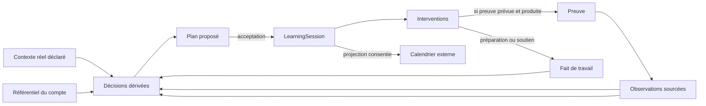

# Twiny — modèle métier cible

> Architecture métier cible en cours de conception. Ce document fixe un
> vocabulaire et des frontières ; ce n'est ni un schéma SQL, ni une liste de
> services, ni une stratégie de migration.
>
> Le code reste la vérité de ce qui est construit. Aucun concept présenté ici
> ne devient automatiquement une table ou une entité persistée.

**Révision du 27/08/2026.** La carte globale partagée, les objectifs structurés
et le parcours persistant des premières versions de ce document ne sont plus
la cible. La carte globale a été écartée par l'ADR-099 ; les intentions restent
déclarées sans extraction automatique ; le plan est une hypothèse dérivée.
L'ADR-139 décrit la direction humaine validée et son statut non construit.

## 1. Vue de synthèse

La boucle cible est :

**contexte → plan proposé → séances acceptées → travail → observations →
estimation → replanification**.

Le plan et les estimations sont temporaires et recalculables. Le référentiel,
les déclarations, les séances acceptées et les observations sont durables.

## 2. Les six couches

| # | Couche | Contenu cible | Règle |
|---|---|---|---|
| 0 | **Ignore** | limites et non-affirmations | garde-fou explicite |
| 1 | **Connaît** | référentiel et contexte déclarés | stocké, jamais calculé |
| 2 | **Observe** | faits et mesures sourcés | stocké, jamais fabriqué |
| 3 | **Décide** | états, plan, priorités, hypothèses | dérivé, jamais autoritatif |
| 4 | **Fait faire** | séances et interventions proposées | interface entre décision et action |
| 5 | **Fait des données** | stockage, droits, synchronisations | infrastructure, pas métier |

La frontière est non négociable : les couches 1 et 2 ne se recalculent pas ;
la couche 3 ne se stocke pas comme vérité.

## 3. Ignore

Twiny refuse d'affirmer :

- qu'une absence de preuve vaut zéro ;
- qu'un travail terminé a forcément mesuré une compétence ;
- qu'une séance manquée prouve une faiblesse ou un manque de motivation ;
- qu'une disponibilité de calendrier est une capacité pédagogique ;
- qu'une corrélation observée est une cause ;
- qu'une personne est prête lorsque les preuves disponibles ne permettent pas
  de l'estimer ;
- qu'un document envoyé au tuteur peut devenir une mesure ;
- qu'une intention libre peut être transformée sans confirmation en objectif
  structuré.

## 4. Connaît : référentiel durable du compte

### Domaine

Un domaine organise le référentiel du compte. Dans le cadre scolaire, un
module de cours est un usage du domaine, pas une entité séparée.

### Compétence

Une capacité démontrable, identifiée par un code stable du référentiel actif.
Le tuteur choisit uniquement parmi les codes fournis par le serveur.

### Connaissance

Un contenu ou concept mobilisable. Une connaissance ne porte pas l'état de la
personne.

### Relation

Un lien déclaré entre éléments du référentiel. Il sert à organiser et à
raisonner ; sa présence ne prouve aucune maîtrise.

## 5. Connaît : contexte déclaré

Le contexte réel nécessaire au plan peut comprendre :

- des intentions formulées par la personne ;
- des engagements et échéances ;
- l'année, la période ou le rythme académique ;
- des créneaux disponibles ou indisponibles ;
- les domaines suivis ;
- les ressources explicitement rattachées à ces domaines ;
- les préférences de travail déclarées.

Ces données sont des contraintes et des déclarations. Elles ne deviennent ni
un état de compétence, ni une mesure de performance.

Une disponibilité importée d'un calendrier appartient à cette couche après
consentement. Elle ne devient pas automatiquement un événement métier détaillé.

## 6. Observe

### Activité

Ce qui a effectivement été fait. Une activité peut appartenir à une séance
acceptée ou être déclarée a posteriori.

### Preuve

Une trace vérifiable, ou une référence durable vers un artefact vérifiable.
Elle n'est pas une note inventée par le tuteur.

### Observation

Une mesure sourcée produite selon un protocole. Elle désigne la preuve, la
compétence concernée, la règle de mesure et les réserves nécessaires.

### Fait d'orchestration

Une acceptation, un déplacement, un refus, un abandon ou l'achèvement d'un
travail sans mesure. Ces faits permettent de replanifier. Ils ne sont jamais
des observations de compétence.

Une tentative abandonnée ne produit pas de preuve. Une séance manquée ne crée
pas de dette morale et ne diminue pas un état.

## 7. Décide

Tout contenu de cette couche est recalculable à partir des couches Connaît et
Observe.

### État de compétence

Estimation prudente de la maîtrise, de la confiance et de l'ancienneté des
preuves. Une faiblesse ne disparaît pas sans nouvelle démonstration.

### Préparation à une échéance

Lecture qualitative des preuves disponibles, par exemple :

- non estimable ;
- à éclaircir ;
- à renforcer ;
- en bonne voie ;
- prêt d'après les preuves disponibles.

Elle n'est pas stockée comme score. Une durée estimée ou un volume de travail
ne constitue pas une mesure de préparation.

### Plan proposé

Ensemble ordonné et daté de séances candidates. Il arbitre les engagements,
les disponibilités, les besoins continus, les états et les séances déjà
acceptées.

Le plan n'est pas une liste que la personne doit entretenir. Twiny le recalcule
et présente les changements utiles avec leur raison et leurs réserves.

### Recommandation

La meilleure prochaine intervention compte tenu du plan courant. Elle reste
explicable, contestable et remplaçable.

### Hypothèse d'apprentissage

Un motif possible observé sur plusieurs faits, présenté comme hypothèse et non
comme causalité. Il porte son échantillon, sa confiance et ses limites. La
personne peut accepter de le tester ou l'écarter.

## 8. Fait faire : `LearningSession`

`LearningSession` est l'unique épisode de travail matérialisé. Aucune entité de
travail parallèle n'est créée.

Seules les séances acceptées deviennent des `LearningSession`. Une séance
candidate qui reste dans le plan dérivé n'existe pas comme travail persistant.

Une séance contient une ou plusieurs interventions :

- résoudre ;
- expliquer ;
- rappeler ;
- lire ;
- synthétiser ;
- produire ;
- diagnostiquer ;
- demander de l'aide.

Chaque intervention annonce son effet attendu :

- **mesure** : une preuve peut produire une observation selon un protocole ;
- **préparation** : le travail prépare une action ultérieure sans mesurer ;
- **soutien** : le travail débloque, explique ou aide sans mesurer par défaut.

Le type d'intervention ne suffit jamais à fabriquer une observation. Seul un
contrat de preuve effectivement rempli permet d'en produire une.

Une séance planifiée peut être déplacée ou annulée. Son historique factuel est
conservé si nécessaire, mais les décisions qui en découlaient sont recalculées.

## 9. Ressources et documents

Une ressource appartient au contexte d'un domaine ou d'une séance. Elle peut
ancrer une lecture, une synthèse, une production ou une génération d'exercices.

Le contexte permanent du tuteur ne contient aucun corpus documentaire. Un
document ne lui parvient que par un geste explicite, composé côté client et
relu avant l'envoi. Rien de ce qui vient d'un document ne devient une mesure.

Le protocole d'analyse d'un cours produit des informations et des séances
candidates pour le plan global. Il ne crée pas un second plan autonome. Les
exercices absents sont générés au démarrage de la séance acceptée qui les
demande, avec l'ancrage prévu par son origine.

## 10. Fait des données

Supabase reste la source de vérité des déclarations, séances acceptées,
activités, preuves et observations. RLS reste la frontière d'autorisation.

Un calendrier externe est une projection consentie :

- Twiny lit uniquement les informations nécessaires à la disponibilité ;
- seules les séances acceptées sont écrites à l'extérieur ;
- un événement externe ne porte ni preuve, ni diagnostic, ni détail sensible ;
- une modification externe devient un fait d'orchestration à traiter ;
- Supabase, et non le calendrier, reste la vérité pédagogique.

Le connecteur, les curseurs de synchronisation et les erreurs appartiennent à
l'infrastructure. Leur forme persistée doit faire l'objet d'une décision et
d'une vérification de la base réelle avant implémentation.

## 11. Boucle dynamique cible

1. La personne déclare ou confirme son contexte.
2. Twiny estime ce qui est estimable et rend visibles les inconnues.
3. Le moteur propose un plan sans le persister.
4. La personne accepte un ensemble de séances ou demande un ajustement.
5. Les séances acceptées deviennent des `LearningSession`.
6. Chaque séance fait exécuter des interventions explicites.
7. Seules les preuves conformes produisent des observations.
8. Les faits de travail et les observations modifient les entrées du moteur.
9. Les états, la préparation, le plan et la prochaine recommandation sont
   recalculés.
10. Twiny présente les changements importants en une revue groupée ; la
    personne n'orchestre jamais la maintenance interne du système.

## 12. Statut d'implémentation

Le modèle ci-dessus décrit une direction validée, pas un état construit.

- Le référentiel par compte, les preuves, observations, états dérivés et la
  recommandation immédiate existent en partie dans le code courant.
- `LearningSession` existe et son registre multi-interventions est outillé
  localement ; sa validation en parcours réel reste ouverte.
- Les engagements, ressources de cours et séances datées existent sous des
  formes partielles.
- Le plan temporel pur, l'acceptation et la replanification groupée sont
  outillés localement. Le protocole de cours fournit des candidates et la fiche
  module dérive ses lectures, mais le raccordement global n'a pas encore la
  parité nécessaire pour retirer son ancien écrivain. La synchronisation
  calendrier et les hypothèses de motifs ne sont pas construites.

Toute migration commence par comparer ce modèle au code et à la base réels.
Elle reste verticale, réversible et sans refonte globale.
