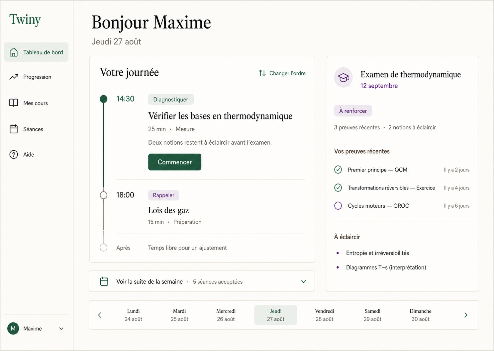

# Orchestration pédagogique — solution d'interface

> Statut : **première tranche construite — intégration complète à valider**.
>
> Le tableau de bord calcule maintenant une proposition éphémère à partir du
> contexte déclaré et des recommandations historiques, puis permet d'accepter
> explicitement les séances retenues. La replanification et les candidats de
> cours restent à construire.
>
> Les contrats produit viennent de `PRODUCT.md` et de l'ADR-139. Les choix
> précis d'interface et le séquencement ci-dessous sont une traduction de ces
> contrats ; ils ne montent aucun statut de construction.

## Référence visuelle validée du tableau de bord

Maxime a validé le 27/08/2026 la composition « Votre journée » avec la carte
d'échéance détaillée. Cette image reste la cible de fidélité de la composition
du tableau de bord ; elle ne décrit pas à elle seule le parcours de proposition
et de replanification.

La mise en œuvre doit conserver la structure, la densité, la hiérarchie et le
langage visuel de cette référence. La première carte de proposition s'insère
au-dessus de cette composition, avec divulgation progressive des réserves ;
elle disparaît après acceptation et ne transforme pas l'écran en interface de
maintenance. Les données réelles peuvent changer les libellés et le nombre de
lignes.

## 1. Résultat recherché

Twiny doit donner à la personne trois réponses sans lui demander d'administrer
le système :

1. **Que faire maintenant ?**
2. **Que va-t-il se passer ensuite ?**
3. **Pourquoi le plan change-t-il ?**

Le produit collecte ou fait confirmer les faits ambigus, calcule le plan,
regroupe les ajustements et matérialise uniquement les séances acceptées sous
forme de `LearningSession`.

Aucune nouvelle destination principale et aucune entité de travail ne sont
nécessaires.

## 2. Architecture de navigation

| Destination existante | Responsabilité cible |
|---|---|
| **Tableau de bord** | arbitrage immédiat, journée, aperçu de la semaine, changements importants |
| **Séances** | chronologie des séances acceptées, exécution et historique |
| **Mes cours** | contexte académique, ressources, échéances et effet du plan par domaine |
| **Progression** | évolution longue, preuves, réserves et hypothèses de motifs |
| **Compte** | connexion calendrier, consentements et préférences |

Il ne faut créer ni route « Plan », ni route « Calendrier », ni centre de
maintenance. Le plan traverse les surfaces existantes selon leur rôle.

## 3. Tableau de bord

### 3.1 Hiérarchie cible

La grille actuelle est conservée : contenu principal à gauche, contexte à
droite sur grand écran, une seule colonne sur mobile.

#### Maintenant

La `CarteProchaineAction` reste la porte d'entrée. Elle affiche :

- l'intervention concrète : résoudre, expliquer, rappeler, lire, synthétiser,
  produire, diagnostiquer ou demander de l'aide ;
- le domaine, la durée et la source ;
- l'effet attendu : mesure, préparation ou soutien ;
- la raison principale et, dans `PanneauExplication`, les facteurs et réserves.

Actions :

- `Bouton` **principal** : « Commencer » ;
- `Bouton` **secondaire** : « Changer » ;
- `Depliant` : alternatives calculées, à la place d'un bloc permanent.

#### Aujourd'hui

Une liste courte montre les `LearningSession` acceptées, dans l'ordre. Chaque
ligne contient l'heure, la durée, l'intervention, le domaine et un statut en
texte. Une séance active remonte en premier.

La personne peut déplacer ou annuler une séance, mais n'a jamais à réparer
manuellement les conséquences : le moteur recalcule le reste.

#### Cette semaine

Un `PanneauPliable` présente les séances acceptées groupées par jour et les
espaces encore disponibles. Ce n'est pas une grille de calendrier dense. Sur
mobile, la chronologie verticale reste identique.

### 3.2 Colonne de contexte

Les deux affichages d'échéance actuels deviennent une seule `Carte` :

- prochaine échéance ;
- préparation qualitative ;
- preuves disponibles et inconnues importantes ;
- prochaine séance qui la fait progresser ;
- accès aux réserves par `PanneauExplication`.

Les états affichés sont : « Non estimable », « À éclaircir », « À renforcer »,
« En bonne voie » et « Prêt d'après les preuves disponibles ». Aucun
pourcentage de préparation n'est montré avant calibration.

Une seconde carte peut demander une confirmation contextuelle ponctuelle, par
exemple : « Ce cours a-t-il bien eu lieu aujourd'hui ? » ou « Ajouter le
support utilisé ? ». Elle ne devient jamais une boîte de réception à vider.

### 3.3 Replanification

Les changements qui ne touchent encore aucune séance acceptée sont appliqués
au plan dérivé sans solliciter la personne.

Si des `LearningSession` acceptées doivent changer, Twiny affiche une revue
groupée dans une `Modale` :

- résumé : « 2 séances déplacées, 1 ajoutée, 1 raccourcie » ;
- comparaison avant/après par séance ;
- raisons principales visibles ;
- détails et réserves dans des `Depliant` ;
- `Bouton` **principal** : « Appliquer ces ajustements » ;
- `Bouton` **secondaire** : « Modifier » ;
- `Bouton` **discret** : « Garder mon plan ».

L'acceptation applique le lot de manière atomique. La personne arbitre une
proposition compréhensible ; elle ne déplace pas les dépendances une par une.

### 3.4 Proposition de séances

La carte affiche une proposition éphémère, jamais un écran technique. Chaque
séance est cochée par défaut et peut être arbitrée individuellement. Au-delà
d'une séance, les actions « Tout sélectionner » et « Tout désélectionner »
réduisent le coût de lecture. « Accepter les séances sélectionnées » ne crée
que les séances cochées ; « Ignorer cette proposition » permet de tout refuser
sans créer de `LearningSession`.

La référence opaque de la carte est stable pour les mêmes échéances, créneaux,
états, recommandations et séances acceptées. Le refus entier est conservé
comme un fait de planification dans la table de refus existante et empêche la
réapparition jusqu'à un changement matériel. Une carte vide explique la cause
en termes de disponibilités, d'échéances ou de travaux. Les réserves techniques
et erreurs de service sont traduites à l'écran et restent détaillées dans les
journaux ; aucun identifiant interne n'est affiché.

## 4. Séances

### 4.1 Page d'entrée

La page `/seances` ouvre par défaut sur **À venir**, une chronologie des
`LearningSession` acceptées. **Historique** conserve le cahier actuel.

Le `ConcepteurSeance` n'est plus le parcours principal. Il reste accessible
par l'action secondaire « Préparer autre chose » et sert aussi de socle à
l'édition contrôlée d'une séance.

Le calendrier du cahier reste un navigateur d'historique. Il ne doit pas être
détourné en planificateur : une chronologie répond mieux au mobile, au clavier
et à la lecture d'un plan qui change.

### 4.2 Coquille commune d'une `LearningSession`

Les briques actuelles restent la base : `VueSeanceDetail`, `SasSeance`, outils
de séance, minuteur, tuteur repliable, documents et `CarteImpact`.

La séance reçoit une liste typée d'interventions. Un registre associe chaque
type à son rendu :

| Intervention | Réemploi prioritaire | Mesure par défaut |
|---|---|---|
| Résoudre | `VueExercice` et correction existante | oui, si preuve valide |
| Expliquer | exercice Feynman déterministe | seulement avec contrat de preuve |
| Rappeler | cartes de rappel existantes | seulement avec réponse vérifiable |
| Lire | lecteur de document et objectif de lecture | non |
| Synthétiser | espace d'écriture/document | non, sauf contrat explicite |
| Produire | espace projet/document | non, sauf contrat explicite |
| Diagnostiquer | exercice court ciblé | oui, si preuve valide |
| Demander de l'aide | tiroir tuteur avec contexte relu | non |

L'en-tête de chaque intervention affiche sa nature, sa durée, sa source et son
effet attendu. Une intervention sans mesure se termine par un `BandeauInfo`
explicite : le travail est terminé, mais aucune nouvelle mesure n'a été
produite. Une mesure n'apparaît que via le chemin de preuve existant.

Les documents restent transmis au tuteur par un geste explicite et une
composition relue, conformément à l'ADR-124.

## 5. Mes cours

Le module reste un domaine du référentiel. Sa page reçoit deux vues dérivées :

- « Cette semaine » : séances acceptées liées au domaine ;
- « Échéances » : préparation qualitative, preuves et inconnues.

L'ajout d'un support préremplit le domaine, le cours et la date lorsque le
contexte le permet. La personne vérifie ces faits ; elle n'a pas à reconstruire
le plan.

Le protocole PDF existant change de sortie : son analyse, son ancrage dans le
document, ses exercices Feynman et ses cartes de rappel sont conservés, mais
ils alimentent les actions candidates du plan global. Il ne matérialise plus
un plan isolé par document.

**État d'intégration du lot 8.** L'adaptateur de candidates, l'ancrage au PDF
exact et les deux lectures dérivées de la fiche module sont construits et
testés localement. La dernière phrase ci-dessus reste la cible : l'ancien
écrivain du protocole est conservé tant que la collecte des disponibilités et
l'acceptation atomique ne savent pas préserver sa commande documentaire. Ce
maintien temporaire n'est pas une seconde cible validée et ne monte aucun
statut.

## 6. Configuration des créneaux et échéances

Le premier succès rapide actuel est conservé. Ensuite, le tableau de bord
expose une carte permanente « Vos créneaux et échéances » :

1. ajouter plusieurs créneaux avec jour, début et fin ;
2. modifier ou supprimer un créneau existant ;
3. refuser les plages inversées et les chevauchements ;
4. déclarer plusieurs échéances successivement via le formulaire existant.

La carte reste réouvrable sans état local de progression. Les faits sont relus
depuis Supabase, l'absence de créneau reste une absence de fait et le calendrier
externe demeure un chantier d'infrastructure séparé. Aucun vocabulaire de
période ni aucune étape à acquitter ne sont nécessaires.

État de construction : l'éditeur de créneaux est branché au profil et transmet
le tableau complet au planificateur. L'échéance est créée par
ModaleEngagement, réutilisée sans nouvelle entité. Le plan global et
l'arbitrage de besoins concurrents restent à raccorder au planificateur.

## 7. Calendrier externe

La connexion vit dans **Compte > Calendrier** avec un consentement précis. Le
connecteur :

- lit le minimum nécessaire pour déduire les plages occupées ;
- écrit uniquement les `LearningSession` acceptées ;
- utilise des titres sobres sans compétence, preuve ou diagnostic ;
- montre l'état de synchronisation avec `Etiquette` et les erreurs persistantes
  avec `BandeauInfo` ;
- traite une modification externe comme un fait d'orchestration qui déclenche
  une proposition d'ajustement.

Une déconnexion utilise le bouton **danger**. La suppression des projections
externes est expliquée séparément du maintien des faits pédagogiques dans
Twiny. Le stockage technique, les droits et les curseurs de synchronisation
nécessitent une ADR d'infrastructure et une vérification préalable de la base
réelle.

## 8. Besoins concurrents et travail continu

« Déclarer un besoin » reste l'entrée unique. Un besoin continu peut recevoir
un rythme ou un horizon déclarés ; il ne devient pas un objectif structuré
extrait automatiquement.

La politique arbitre les échéances proches sans supprimer silencieusement le
travail continu. Si la capacité ne permet pas tout, elle présente la tension et
propose un compromis. Une séance déjà acceptée n'est modifiée qu'après revue.

## 9. Hypothèses de motifs

La page **Progression** peut accueillir une section « Ce qui semble vous
aider » uniquement après un échantillon minimal défini. Chaque carte indique :

- l'observation formulée sans causalité ;
- la période et le nombre de cas ;
- la confiance et les réserves ;
- l'action « Tester pendant une semaine » ;
- l'action discrète « Ne plus proposer cette hypothèse ».

Un motif n'est jamais déduit d'une seule séance, d'une absence ou d'un
calendrier. Son acceptation lance une expérience limitée ; elle ne change pas
silencieusement une règle permanente.

## 10. Réemploi et suppression

| Existant | Décision cible | Condition de retrait |
|---|---|---|
| `CarteProchaineAction` | conserver et étendre | aucune |
| `PistesAlternatives` autonome | intégrer sous « Changer » | après reprise de ses calculs et tests |
| cartes « Avant vos échéances » / « Progression continue » | fusionner dans « Votre plan » | quand le plan global arbitre les deux besoins |
| `BlocEcheancePrioritaire` + `CarteEcheances` | fusionner en une carte de préparation | après parité des informations utiles |
| `BandeauRepriseBienveillante` et son état navigateur | remplacer par l'ajustement dérivé | après migration sûre de la clé locale |
| `ConcepteurSeance` comme entrée principale | déplacer en parcours secondaire | quand le plan sait matérialiser une séance acceptée |
| planification autonome de `ProtocoleCours` | retirer | quand ses candidats alimentent le plan global |
| analyse PDF, ancrage, Feynman, rappel | conserver | aucune |
| calendrier du cahier | conserver pour l'historique seulement | aucune |
| document `ORCHESTRATION_NOUVEAU_BESOIN.md` | archiver comme exploration remplacée | après validation du présent plan |
| promesse publique « rien à planifier » | remplacer | dans le même changement que la fonctionnalité construite |

Aucun retrait ne précède sa relève fonctionnelle. Les composants et règles
métier utiles sont déplacés avant suppression de leur ancienne composition.

## 11. Cohérence visuelle

### Composants

Utiliser les primitives existantes : `Carte`, `EnTeteCarte`, `CorpsCarte`,
`Modale`, `Bouton`, `Champ`, `SelecteurSegmente`, `BandeauInfo`, `Etiquette`,
`PanneauPliable`, `Depliant`, `PanneauExplication` et `Reserves`.

Ne créer un composant que pour une responsabilité métier réutilisée, par
exemple `ChronologiePlan`, `RevueAjustements` ou `RenduIntervention`. Ne pas
dupliquer les primitives visuelles.

### Boutons

| Variante | Usage |
|---|---|
| **principal** | commencer, accepter un plan, connecter, terminer |
| **secondaire** | changer, déplacer, relire, préparer autre chose |
| **discret** | ignorer, garder le plan, fermer un détail |
| **danger** | déconnecter, annuler une séance acceptée, supprimer |
| **outil** | uniquement dans la barre d'outils d'une séance |

Les nouvelles vues n'ajoutent pas de classes de bouton ad hoc.

### Espacement et densité

- conserver l'unité de 4 px et les jetons de `tokens.css` ;
- conserver `space-y-4` pour les sections courantes ;
- conserver `gap-4` puis `lg:gap-5` pour les grilles principales ;
- conserver la largeur de lecture principale et les rayons existants ;
- préférer la divulgation progressive à l'empilement de cartes ;
- ne pas introduire une couleur, une ombre ou une typographie nouvelle.

### Accessibilité

- statuts toujours exprimés en texte, jamais par la couleur seule ;
- titres et listes sémantiques dans les chronologies ;
- modales avec focus initial, retour de focus et actions clavier ;
- déplacement possible sans glisser-déposer ;
- cibles tactiles d'au moins 44 px ;
- recalcul annoncé sans interrompre la lecture ;
- respect de `prefers-reduced-motion` ;
- vérification clair/sombre, mobile/bureau et contraste AA.

## 12. Écarts à la vision

| Capacité cible | État actuel | Écart principal |
|---|---|---|
| recommandation immédiate | solide | taxonomie d'intervention trop étroite |
| séances acceptées et datées | première tranche | proposition et acceptation branchées ; revue après recalcul à intégrer |
| engagements et échéances | partiel | préparation non estimée et vues dupliquées |
| ressources de cours | partiel | protocole isolé du reste du plan |
| multi-interventions | absent comme contrat commun | rendus dispersés, centrés exercice |
| disponibilités | partiel | fenêtres déclarées sur le profil ; calendrier externe et arbitrage global à construire |
| synchronisation calendrier | absente | contrat d'infrastructure à concevoir |
| replanification | locale et partielle | diff et frontière existent ; déclenchement depuis le tableau de bord à intégrer |
| besoins continus concurrents | partiel | deux chemins d'interface au lieu d'un arbitrage |
| motifs d'apprentissage | absent | seuils et protocole expérimental à définir |

## 13. Plan d'implémentation vertical

Les prompts exécutables, critères de passage et gates de qualité sont détaillés
dans
[`PLAN_IMPLEMENTATION_ORCHESTRATION_PROMPTS.md`](./PLAN_IMPLEMENTATION_ORCHESTRATION_PROMPTS.md).

### Lot 0 — contrats et documentation

- synchroniser `PRODUCT.md`, le modèle cible, les ADR et les contrats moteur ;
- valider le présent plan d'interface ;
- inventorier les clés navigateur et consommateurs à retirer plus tard.

### Lot 1 — langage commun des interventions

- ajouter les types purs d'intervention et d'effet ;
- adapter les exercices et activités existants sans migration big bang ;
- tester qu'une préparation ou un soutien ne produit pas de mesure.

### Lot 2 — première tranche de plan

- couvrir un domaine, une échéance, des disponibilités déclarées et une
  semaine ;
- produire un plan pur, explicable et non stocké ;
- matérialiser uniquement le lot accepté dans `LearningSession` ;
- conserver le classement actuel derrière l'adaptateur initial.

### Lot 3 — surfaces du plan

- intégrer « Maintenant », « Aujourd'hui » et « Cette semaine » au tableau de
  bord ;
- ajouter la chronologie « À venir » dans Séances ;
- ajouter la revue groupée et atomique des ajustements ;
- rendre le concepteur manuel secondaire.

**État au 28/08/2026 :** la première tranche est branchée sur le tableau de
bord. Les recommandations historiques alimentent une proposition éphémère ;
la personne peut accepter tout ou partie du lot via la frontière atomique
existante, puis retrouver les séances dans `/seances`. La revue d'un recalcul
qui touche des séances déjà acceptées reste séparée et non branchée.

### Lot 4 — séance multi-interventions

- créer le registre de rendus ;
- brancher d'abord résoudre, expliquer, rappeler et demander de l'aide ;
- brancher ensuite lire, synthétiser, produire et diagnostiquer ;
- afficher clairement l'effet et le résultat mesuré ou non.

### Lot 5 — cours et protocoles

- faire produire des candidats au protocole de cours ;
- supprimer sa planification autonome après parité ;
- exposer le plan et la préparation par domaine.

### Lot 6 — calendrier et replanification

- décider et construire le connecteur après audit de la base réelle ;
- projeter les séances acceptées ;
- transformer les changements externes en faits d'orchestration ;
- gérer les besoins continus et les conflits de capacité.

### Lot 7 — hypothèses de motifs

- définir l'échantillon minimal et le protocole de test ;
- n'afficher que des hypothèses falsifiables ;
- mesurer leur utilité avant toute automatisation supplémentaire.

## 14. Scénario d'acceptation transversal

1. Une personne confirme un module, une échéance et deux créneaux.
2. Twiny propose une séance de diagnostic puis une séance de préparation.
3. Rien n'est écrit tant que le lot n'est pas accepté.
4. Les deux `LearningSession` apparaissent dans Tableau de bord et Séances.
5. Le diagnostic produit une preuve ; la préparation terminée n'en produit pas.
6. La deuxième séance est manquée : aucune compétence ne baisse.
7. Twiny recalcule, explique le changement et propose un ajustement groupé.
8. Le calendrier externe n'est modifié qu'après acceptation.
9. Les vues Mes cours et Progression reflètent les mêmes faits sans stockage
   d'un état de préparation ou d'un plan parallèle.

Ce scénario doit être vérifié par tests métier, tests d'intégration, parcours
clavier et contrôle visuel mobile/bureau avant tout retrait de l'ancien flux.
